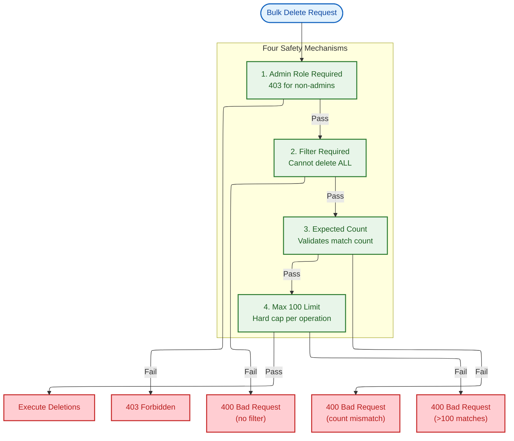
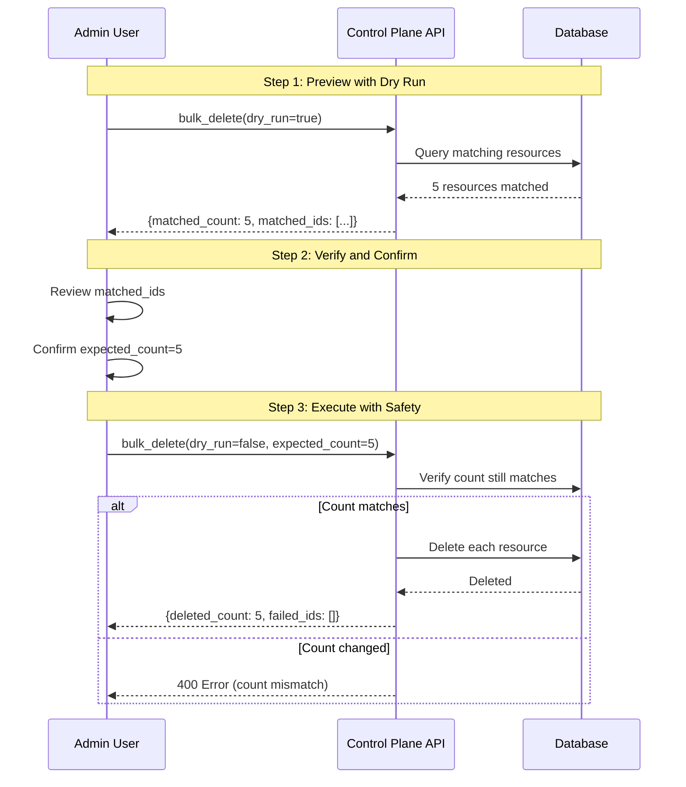
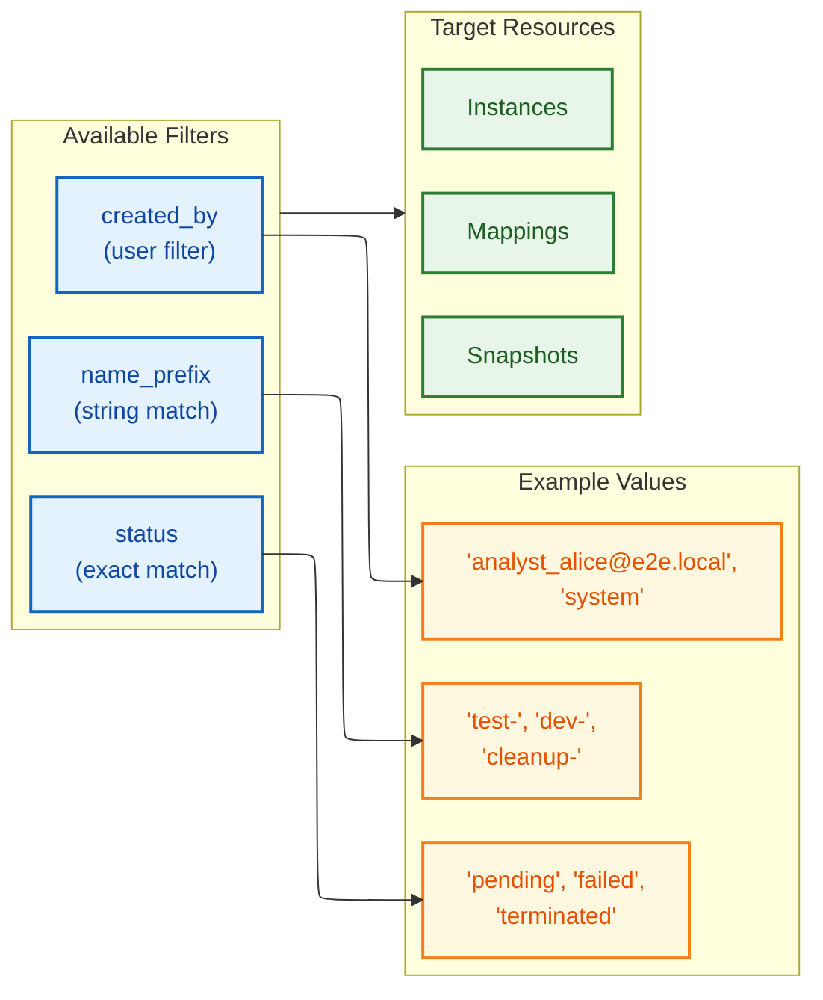
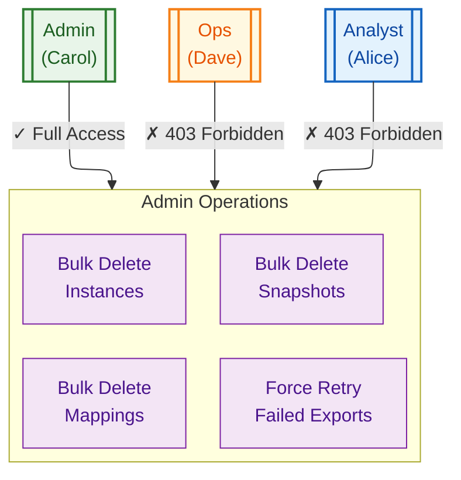
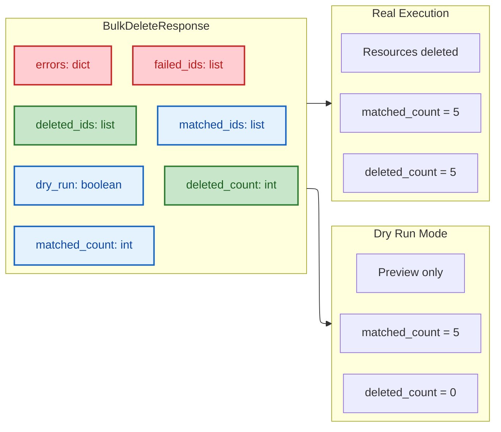

# Admin Operations

## Bulk Delete Safety Mechanisms

Mermaid Source

## Bulk Delete Workflow

Mermaid Source

## Filter Types

Mermaid Source

## Role Access Matrix

Mermaid Source

## Response Structure

Mermaid Source

