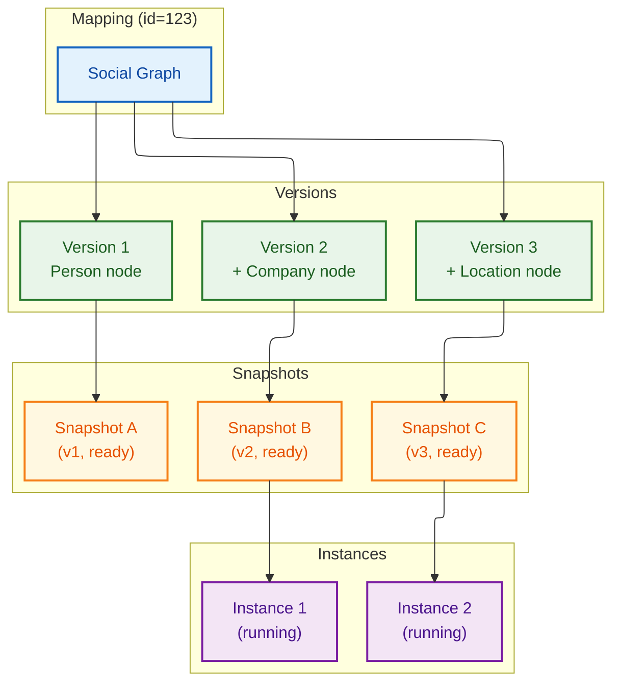
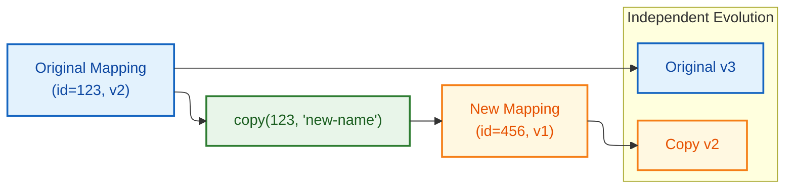
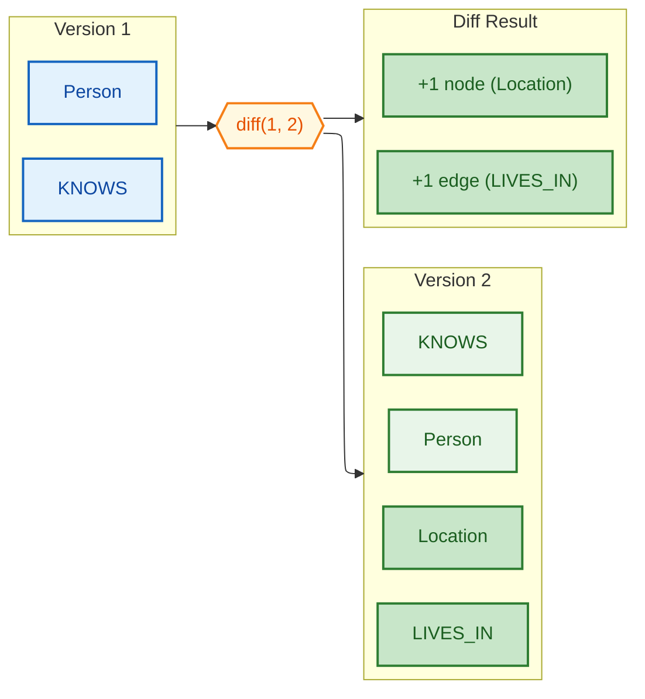
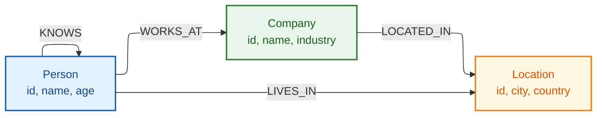

# Advanced Mappings

## Mapping Hierarchy Structure

Mermaid Source

## Copy Mapping Workflow

Mermaid Source

## Version Diff Comparison

Mermaid Source

## Multi-Entity Graph Schema

Mermaid Source

