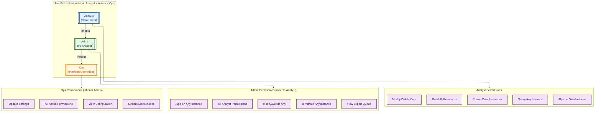
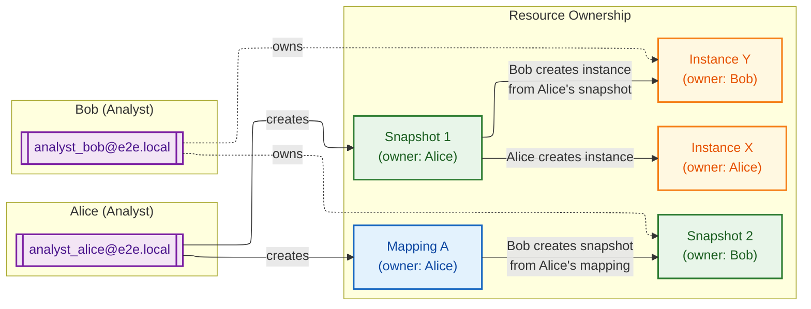
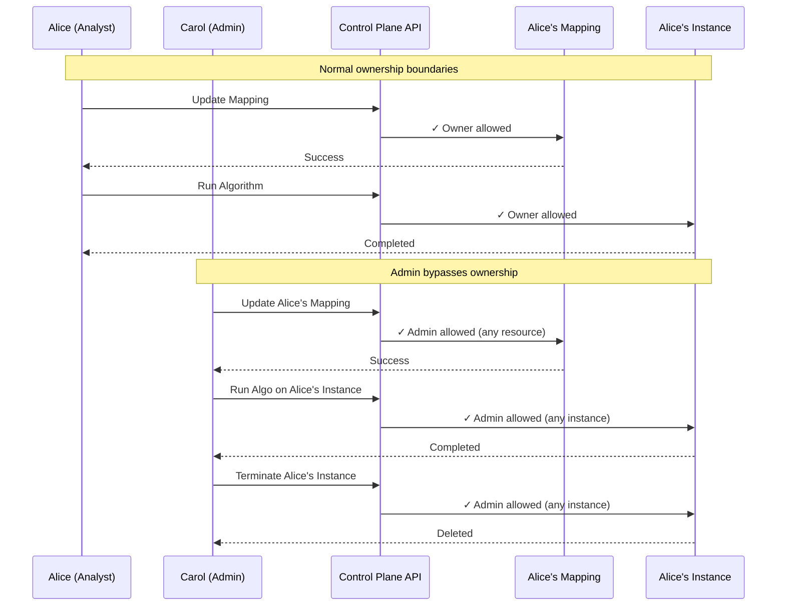
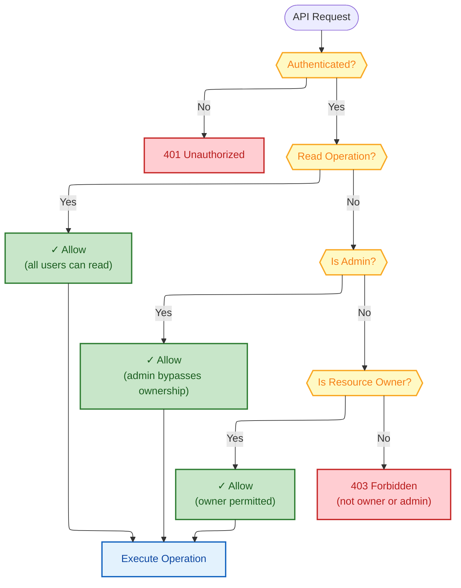

# Authorization

## Role Permission Matrix


<details>
<summary>Mermaid Source</summary>



</details>

## Ownership Model


<details>
<summary>Mermaid Source</summary>



</details>

## Instance Access Control


<details>
<summary>Mermaid Source</summary>

```mermaid
---
config:
  layout: elk
---
flowchart TB
    accTitle: Instance Access Control
    accDescr: Shows the difference between query access and algorithm execution permissions

    classDef query fill:#E8F5E9,stroke:#2E7D32,stroke-width:2px,color:#1B5E20
    classDef algo fill:#FFCDD2,stroke:#C62828,stroke-width:2px,color:#B71C1C
    classDef user fill:#F3E5F5,stroke:#7B1FA2,stroke-width:2px,color:#4A148C
    classDef instance fill:#FFF8E1,stroke:#F57F17,stroke-width:2px,color:#E65100

    INST[("Instance<br/>(owner: Alice)"]]:::instance

    subgraph QueryAccess["Query Access (Read-Only)"]
        direction TB
        Q1["Any Analyst"]:::query
        Q2["Admin"]:::query
        Q_DESC["MATCH (n) RETURN n<br/>Read graph data"]
    end

    subgraph AlgoAccess["Algorithm Execution (Write)"]
        direction TB
        A1["Instance Owner Only"]:::algo
        A2["Admin (any instance)"]:::algo
        A_DESC["PageRank, Louvain, etc.<br/>Writes properties to nodes"]
    end

    QueryAccess -->|"✓ Allowed"| INST
    AlgoAccess -->|"✓ Owner/Admin Only"| INST

    BOB[["Bob<br/>(not owner)"]]:::user
    BOB -.->|"✗ 403 Forbidden"| AlgoAccess
```

</details>

## Admin Cross-User Access


<details>
<summary>Mermaid Source</summary>



</details>

## Permission Enforcement Flow


<details>
<summary>Mermaid Source</summary>



</details>


