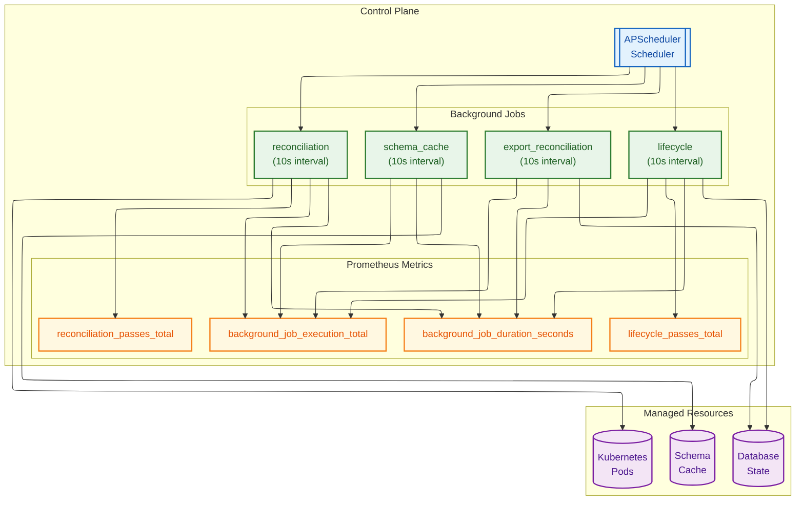
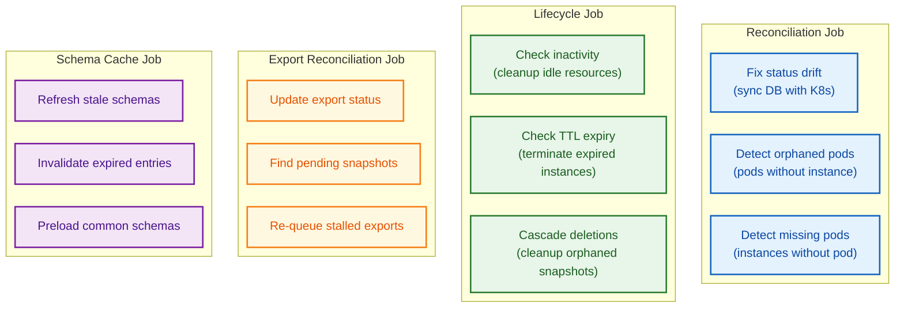
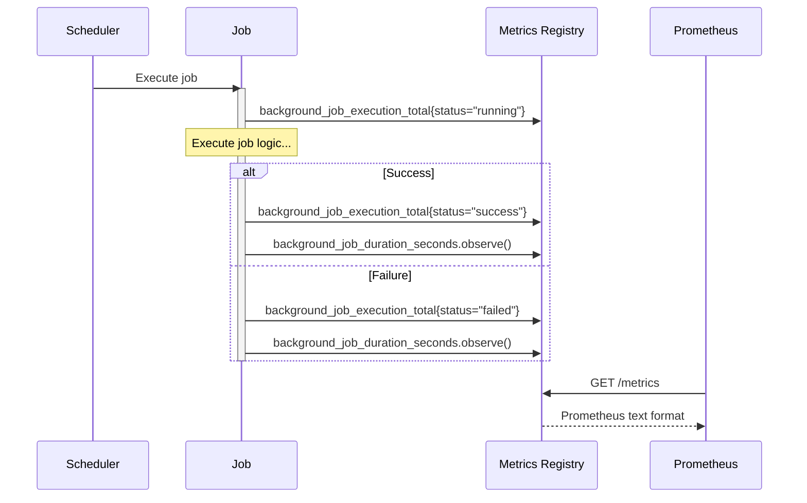
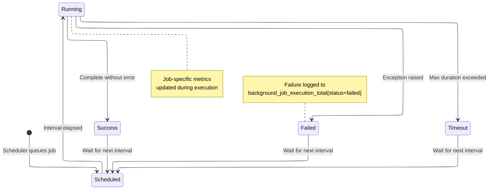
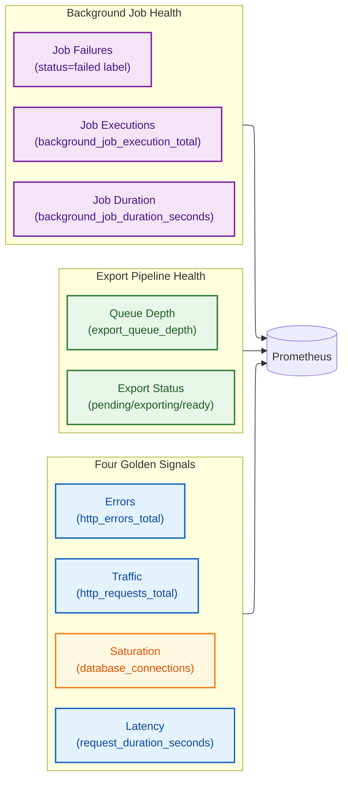

# Background Jobs

## Background Job Architecture

Mermaid Source

## Job Responsibilities

Mermaid Source

## Metrics Collection Flow

Mermaid Source

## Job Execution Lifecycle

Mermaid Source

## Production Metrics Dashboard

Mermaid Source

