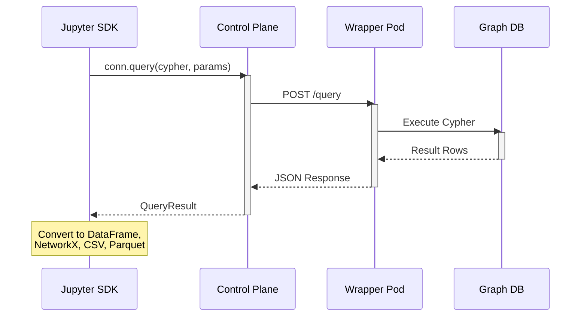

# Cypher Query Execution Flow

Mermaid Source

```mermaid
---
config:
  layout: elk
---
sequenceDiagram
    accTitle: Cypher Query Execution Flow
    accDescr: Shows how queries flow from SDK through Control Plane to Graph Instance

    participant SDK as Jupyter SDK
    participant CP as Control Plane
    participant Wrapper as Wrapper Pod
    participant Graph as Graph DB

    SDK->>CP: conn.query(cypher, params)
    activate CP
    CP->>Wrapper: POST /query
    activate Wrapper
    Wrapper->>Graph: Execute Cypher
    activate Graph
    Graph-->>Wrapper: Result Rows
    deactivate Graph
    Wrapper-->>CP: JSON Response
    deactivate Wrapper
    CP-->>SDK: QueryResult
    deactivate CP

    Note over SDK: Convert to DataFrame,<br/>NetworkX, CSV, Parquet
```

