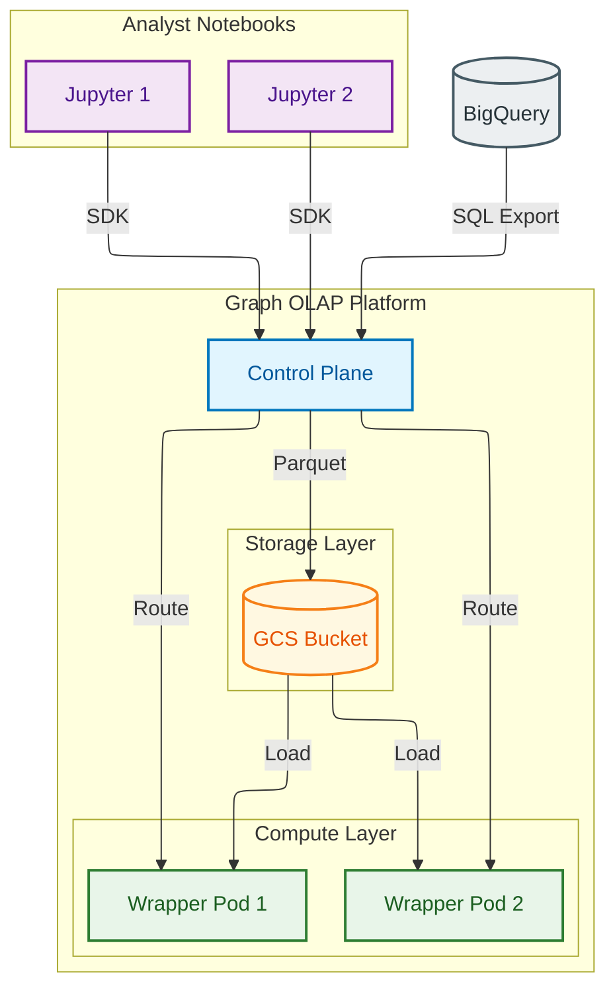

# End-to-End Workflows

## Complete Analyst Journey

Mermaid Source

```mermaid
---
config:
  layout: elk
---
flowchart LR
    accTitle: Complete Analyst Journey
    accDescr: Shows the full analyst workflow from data warehouse to graph insights

    classDef data fill:#FFF8E1,stroke:#F57F17,stroke-width:2px,color:#E65100
    classDef resource fill:#E1F5FE,stroke:#0277BD,stroke-width:2px,color:#01579B
    classDef action fill:#E8F5E9,stroke:#2E7D32,stroke-width:2px,color:#1B5E20
    classDef output fill:#F3E5F5,stroke:#7B1FA2,stroke-width:2px,color:#4A148C

    subgraph Source["Data Source"]
        DW[(BigQuery<br/>Data Warehouse)]:::data
    end

    subgraph Define["1. Define Schema"]
        M[Create Mapping]:::resource
        SQL["SQL Queries<br/>for Nodes/Edges"]:::action
    end

    subgraph Export["2. Export Data"]
        S[Create Snapshot]:::resource
        GCS["Parquet Files<br/>in GCS"]:::data
    end

    subgraph Query["3. Launch & Query"]
        I[Create Instance]:::resource
        Cypher["Cypher Queries"]:::action
    end

    subgraph Analyze["4. Analyze"]
        Algo[Run Algorithms]:::action
        DF["DataFrames"]:::output
    end

    subgraph Insights["5. Insights"]
        Report["Reports &<br/>Visualizations"]:::output
    end

    DW --> SQL --> M --> S --> GCS --> I --> Cypher --> Algo --> DF --> Report
```

## Workflow Patterns

Mermaid Source

```mermaid
---
config:
  layout: elk
---
flowchart TB
    accTitle: Workflow Patterns
    accDescr: Shows different workflow patterns for using the Graph OLAP SDK

    classDef analyst fill:#E3F2FD,stroke:#1565C0,stroke-width:2px,color:#0D47A1
    classDef explorer fill:#E8F5E9,stroke:#2E7D32,stroke-width:2px,color:#1B5E20
    classDef chain fill:#FFF8E1,stroke:#F57F17,stroke-width:2px,color:#E65100
    classDef df fill:#F3E5F5,stroke:#7B1FA2,stroke-width:2px,color:#4A148C

    subgraph Analyst["Analyst Workflow"]
        direction LR
        A1[List Mappings]:::analyst
        A2[Get Schema]:::analyst
        A3[Query Graph]:::analyst
        A4[Run Algorithm]:::analyst
        A5[Export Results]:::analyst
        A1 --> A2 --> A3 --> A4 --> A5
    end

    subgraph Explorer["Explorer Workflow"]
        direction LR
        E1[Get Schema]:::explorer
        E2[Count Entities]:::explorer
        E3[Sample Data]:::explorer
        E4[Compute Stats]:::explorer
        E1 --> E2 --> E3 --> E4
    end

    subgraph Chain["Chained Operations"]
        direction LR
        C1[Run PageRank]:::chain
        C2[Query Top N]:::chain
        C3[Filter Results]:::chain
        C1 --> C2 --> C3
    end

    subgraph DataFrame["DataFrame Workflow"]
        direction LR
        D1[query_df]:::df
        D2[pandas/polars]:::df
        D3[Visualize]:::df
        D1 --> D2 --> D3
    end
```

## Data Flow Architecture

Mermaid Source

```mermaid
---
config:
  layout: elk
---
flowchart TB
    accTitle: Data Flow Architecture
    accDescr: Shows how data flows from warehouse through Graph OLAP to analyst notebooks

    classDef source fill:#ECEFF1,stroke:#455A64,stroke-width:2px,color:#263238
    classDef platform fill:#E1F5FE,stroke:#0277BD,stroke-width:2px,color:#01579B
    classDef storage fill:#FFF8E1,stroke:#F57F17,stroke-width:2px,color:#E65100
    classDef compute fill:#E8F5E9,stroke:#2E7D32,stroke-width:2px,color:#1B5E20
    classDef user fill:#F3E5F5,stroke:#7B1FA2,stroke-width:2px,color:#4A148C

    BQ[(BigQuery)]:::source

    subgraph Platform["Graph OLAP Platform"]
        CP[Control Plane]:::platform
        subgraph Storage["Storage Layer"]
            GCS[(GCS Bucket)]:::storage
        end
        subgraph Compute["Compute Layer"]
            W1[Wrapper Pod 1]:::compute
            W2[Wrapper Pod 2]:::compute
        end
    end

    subgraph Users["Analyst Notebooks"]
        J1[Jupyter 1]:::user
        J2[Jupyter 2]:::user
    end

    BQ -->|"SQL Export"| CP
    CP -->|"Parquet"| GCS
    GCS -->|"Load"| W1
    GCS -->|"Load"| W2
    J1 -->|"SDK"| CP
    J2 -->|"SDK"| CP
    CP -->|"Route"| W1
    CP -->|"Route"| W2
```

