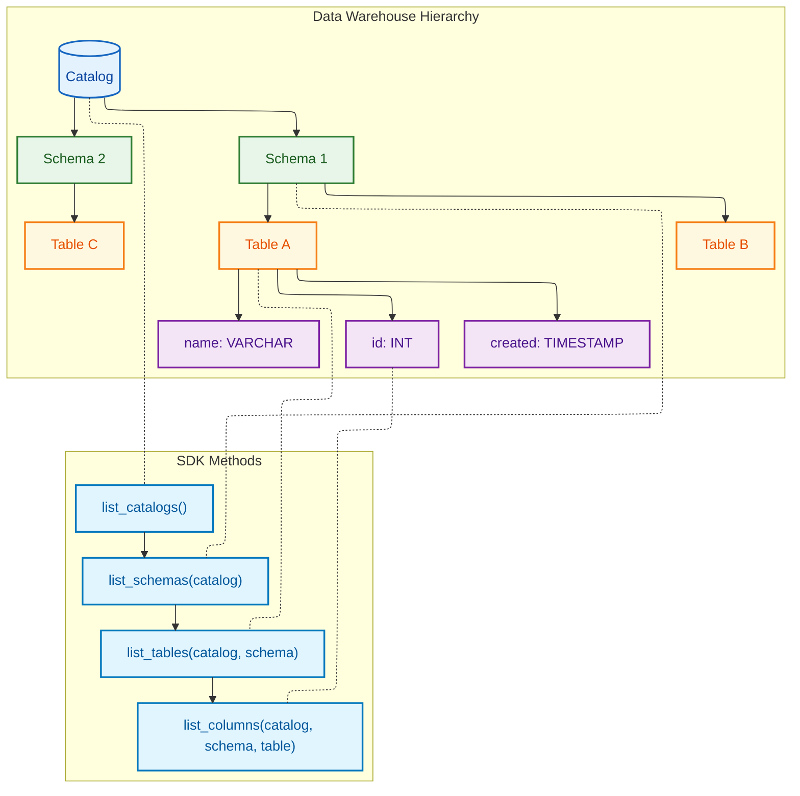
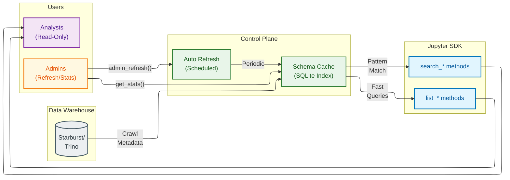
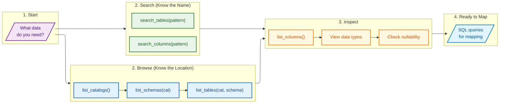
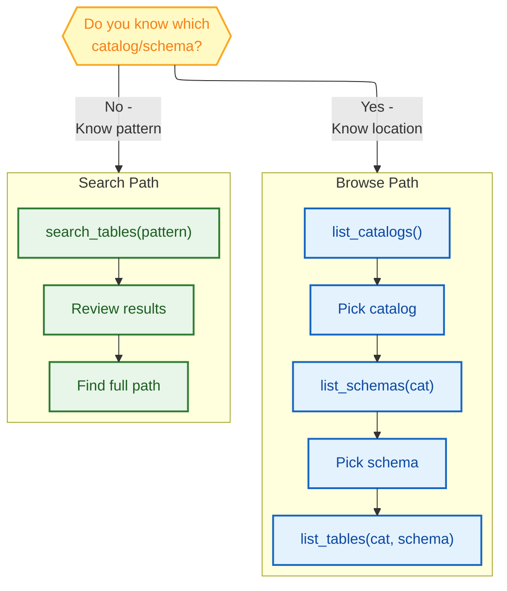

# Exploring Schemas

## Schema Hierarchy

Mermaid Source

## Schema Cache Architecture

Mermaid Source

## Schema Discovery Workflow

Mermaid Source

## Browse vs Search Decision

Mermaid Source

