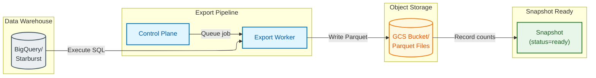
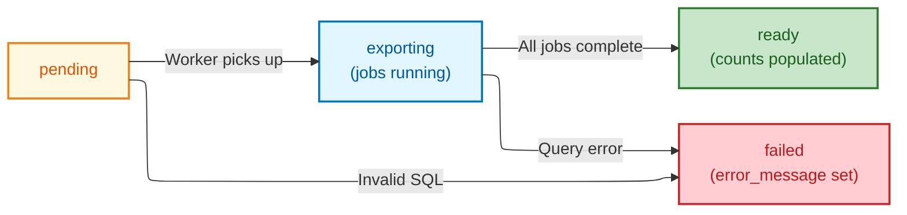
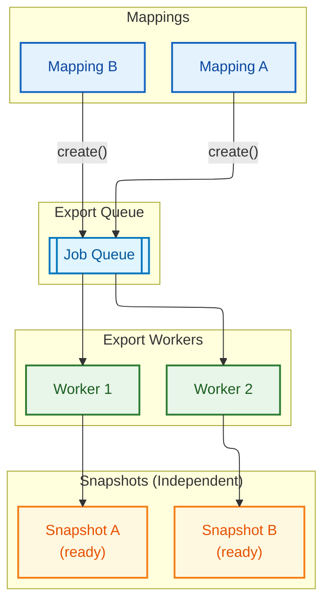
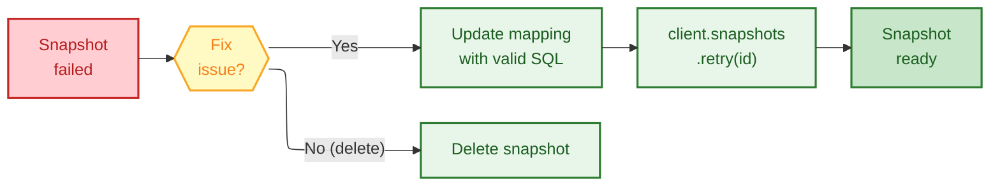

# Export Data

## Snapshot Export Pipeline

Mermaid Source

```mermaid
---
config:
  layout: elk
---
flowchart LR
    accTitle: Snapshot Export Pipeline
    accDescr: Shows how data flows from warehouse through export to storage

    classDef source fill:#ECEFF1,stroke:#455A64,stroke-width:2px,color:#263238
    classDef process fill:#E1F5FE,stroke:#0277BD,stroke-width:2px,color:#01579B
    classDef storage fill:#FFF8E1,stroke:#F57F17,stroke-width:2px,color:#E65100
    classDef result fill:#E8F5E9,stroke:#2E7D32,stroke-width:2px,color:#1B5E20

    subgraph Source["Data Warehouse"]
        BQ[(BigQuery/<br/>Starburst)]:::source
    end

    subgraph Export["Export Pipeline"]
        direction TB
        CP[Control Plane]:::process
        EW[Export Worker]:::process
        CP -->|"Queue job"| EW
    end

    subgraph Storage["Object Storage"]
        GCS[(GCS Bucket/<br/>Parquet Files)]:::storage
    end

    subgraph Result["Snapshot Ready"]
        SS["Snapshot<br/>(status=ready)"]:::result
    end

    BQ -->|"Execute SQL"| EW
    EW -->|"Write Parquet"| GCS
    GCS -->|"Record counts"| SS
```

## Export Progress Phases

Mermaid Source

```mermaid
---
config:
  layout: elk
---
flowchart LR
    accTitle: Export Progress Phases
    accDescr: Shows the phases of snapshot export from pending to ready

    classDef pending fill:#FFF8E1,stroke:#F57F17,stroke-width:2px,color:#E65100
    classDef exporting fill:#E1F5FE,stroke:#0277BD,stroke-width:2px,color:#01579B
    classDef ready fill:#C8E6C9,stroke:#2E7D32,stroke-width:2px,color:#1B5E20
    classDef failed fill:#FFCDD2,stroke:#C62828,stroke-width:2px,color:#B71C1C

    P["pending"]:::pending
    E["exporting<br/>(jobs running)"]:::exporting
    R["ready<br/>(counts populated)"]:::ready
    F["failed<br/>(error_message set)"]:::failed

    P -->|"Worker picks up"| E
    E -->|"All jobs complete"| R
    E -->|"Query error"| F
    P -->|"Invalid SQL"| F
```

## Concurrent Export Handling

Mermaid Source

```mermaid
---
config:
  layout: elk
---
flowchart TB
    accTitle: Concurrent Export Handling
    accDescr: Shows how multiple snapshots can be exported independently

    classDef mapping fill:#E3F2FD,stroke:#1565C0,stroke-width:2px,color:#0D47A1
    classDef snapshot fill:#FFF8E1,stroke:#F57F17,stroke-width:2px,color:#E65100
    classDef worker fill:#E8F5E9,stroke:#2E7D32,stroke-width:2px,color:#1B5E20
    classDef queue fill:#E1F5FE,stroke:#0277BD,stroke-width:2px,color:#01579B

    subgraph Mappings["Mappings"]
        M1["Mapping A"]:::mapping
        M2["Mapping B"]:::mapping
    end

    subgraph Queue["Export Queue"]
        Q[["Job Queue"]]:::queue
    end

    subgraph Workers["Export Workers"]
        W1["Worker 1"]:::worker
        W2["Worker 2"]:::worker
    end

    subgraph Snapshots["Snapshots (Independent)"]
        S1["Snapshot A<br/>(ready)"]:::snapshot
        S2["Snapshot B<br/>(ready)"]:::snapshot
    end

    M1 -->|"create()"| Q
    M2 -->|"create()"| Q
    Q --> W1
    Q --> W2
    W1 --> S1
    W2 --> S2
```

## Retry Failed Snapshot

Mermaid Source

```mermaid
---
config:
  layout: elk
---
flowchart LR
    accTitle: Retry Failed Snapshot Workflow
    accDescr: Shows how to recover from a failed snapshot export

    classDef failed fill:#FFCDD2,stroke:#C62828,stroke-width:2px,color:#B71C1C
    classDef action fill:#E8F5E9,stroke:#2E7D32,stroke-width:2px,color:#1B5E20
    classDef success fill:#C8E6C9,stroke:#2E7D32,stroke-width:2px,color:#1B5E20
    classDef decision fill:#FFF9C4,stroke:#F9A825,stroke-width:2px,color:#F57F17

    F["Snapshot<br/>failed"]:::failed
    D{{"Fix<br/>issue?"}}:::decision
    FIX["Update mapping<br/>with valid SQL"]:::action
    RETRY["client.snapshots<br/>.retry(id)"]:::action
    READY["Snapshot<br/>ready"]:::success

    F --> D
    D -->|"Yes"| FIX
    FIX --> RETRY
    RETRY --> READY
    D -->|"No (delete)"| DEL["Delete snapshot"]:::action
```

