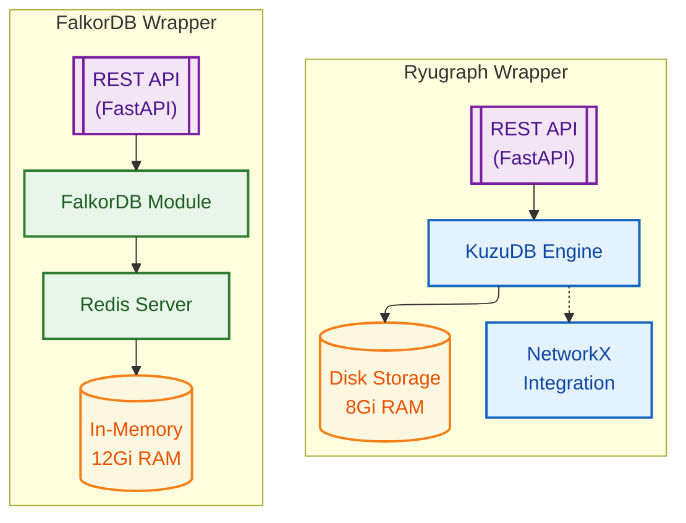
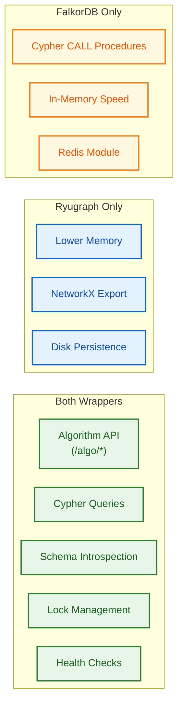
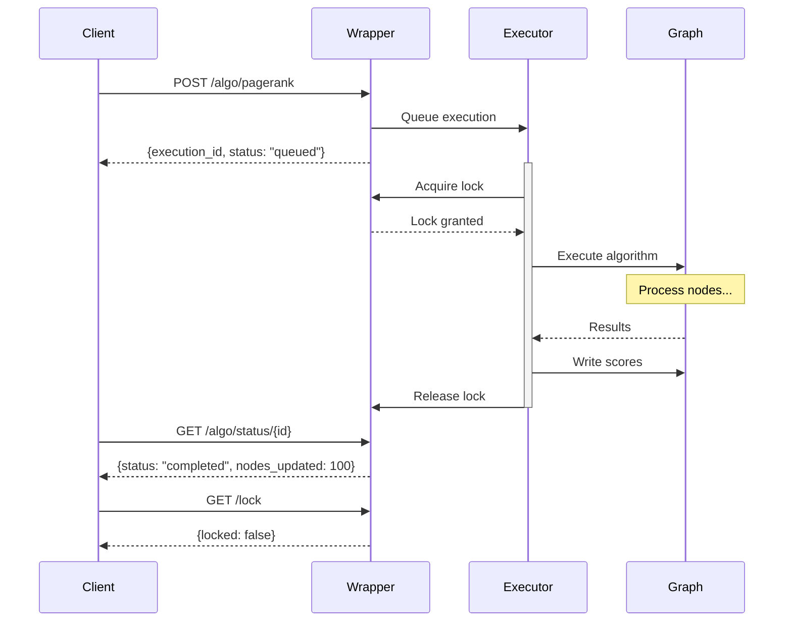
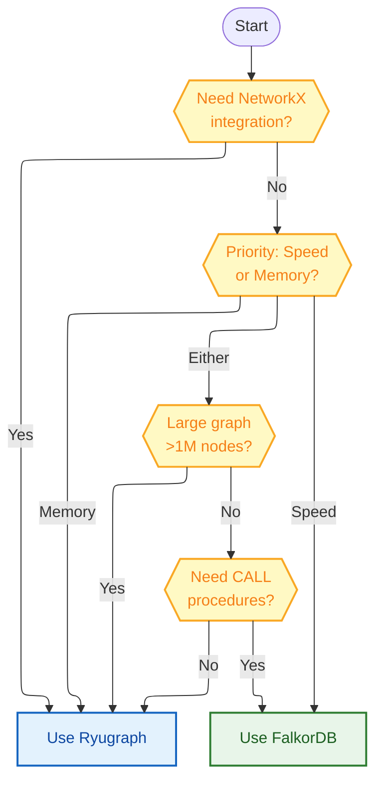

# FalkorDB

## Ryugraph vs FalkorDB Architecture


<details>
<summary>Mermaid Source</summary>



</details>

## Feature Comparison Matrix


<details>
<summary>Mermaid Source</summary>



</details>

## Algorithm API Flow


<details>
<summary>Mermaid Source</summary>



</details>

## Wrapper Selection Decision Tree


<details>
<summary>Mermaid Source</summary>



</details>

## FalkorDB Memory Architecture


<details>
<summary>Mermaid Source</summary>

```mermaid
---
config:
  layout: elk
---
flowchart TB
    accTitle: FalkorDB Memory Architecture
    accDescr: Shows how FalkorDB stores graph data in Redis memory

    classDef redis fill:#E3F2FD,stroke:#1565C0,stroke-width:2px,color:#0D47A1
    classDef graph fill:#E8F5E9,stroke:#2E7D32,stroke-width:2px,color:#1B5E20
    classDef data fill:#FFF8E1,stroke:#F57F17,stroke-width:2px,color:#E65100
    classDef api fill:#F3E5F5,stroke:#7B1FA2,stroke-width:2px,color:#4A148C

    subgraph Pod["FalkorDB Pod (12Gi RAM)"]
        API["FastAPI<br/>Wrapper"]:::api

        subgraph Redis["Redis Server"]
            MOD["FalkorDB<br/>Module"]:::redis

            subgraph Graph["Graph Data (In-Memory)"]
                NODES["Node Matrix<br/>(sparse)"]:::data
                EDGES["Edge Matrix<br/>(sparse)"]:::data
                PROPS["Property Store<br/>(hash tables)"]:::data
                INDEX["Label Indices"]:::graph
            end
        end
    end

    API --> MOD
    MOD --> NODES & EDGES & PROPS
    INDEX --> NODES
```

</details>

