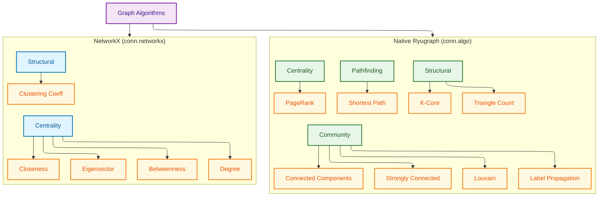
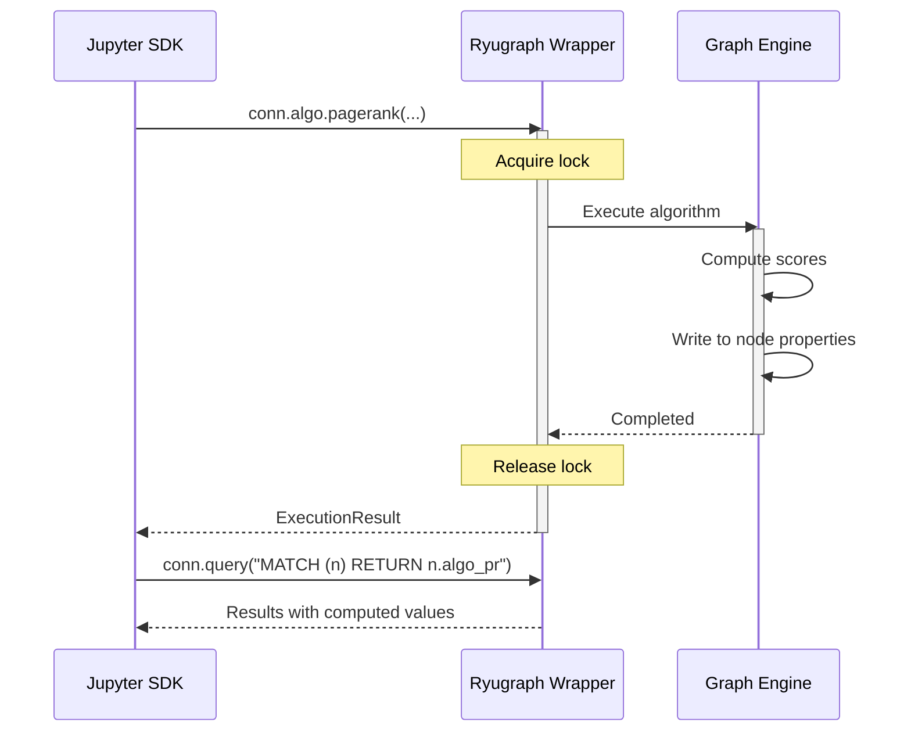
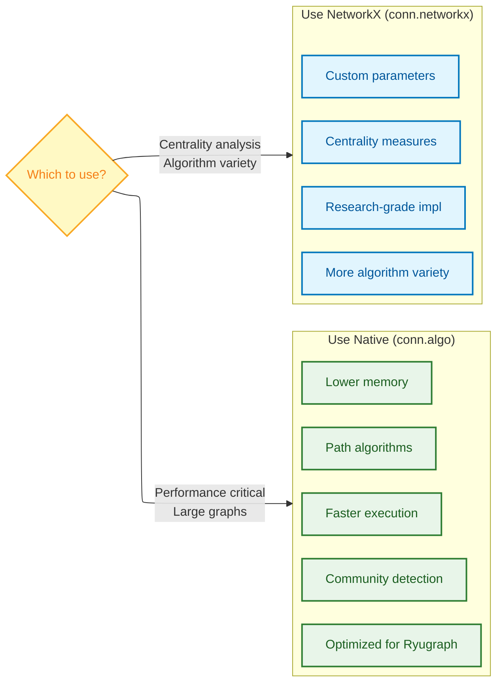

# Graph Algorithms

## Algorithm Categories

Mermaid Source

```mermaid
---
config:
  layout: elk
---
flowchart TB
    accTitle: Graph Algorithm Categories
    accDescr: Shows the taxonomy of available graph algorithms organized by category and engine

    classDef category fill:#F3E5F5,stroke:#7B1FA2,stroke-width:2px,color:#4A148C
    classDef native fill:#E8F5E9,stroke:#2E7D32,stroke-width:2px,color:#1B5E20
    classDef networkx fill:#E1F5FE,stroke:#0277BD,stroke-width:2px,color:#01579B
    classDef algo fill:#FFF8E1,stroke:#F57F17,stroke-width:2px,color:#E65100

    Root[Graph Algorithms]:::category

    subgraph Native["Native Ryugraph (conn.algo)"]
        direction TB
        N_Cent[Centrality]:::native
        N_Comm[Community]:::native
        N_Path[Pathfinding]:::native
        N_Struct[Structural]:::native

        PR[PageRank]:::algo
        WCC[Connected Components]:::algo
        SCC[Strongly Connected]:::algo
        Louv[Louvain]:::algo
        LP[Label Propagation]:::algo
        KC[K-Core]:::algo
        TC[Triangle Count]:::algo
        SP[Shortest Path]:::algo

        N_Cent --> PR
        N_Comm --> WCC
        N_Comm --> SCC
        N_Comm --> Louv
        N_Comm --> LP
        N_Struct --> KC
        N_Struct --> TC
        N_Path --> SP
    end

    subgraph NetworkX["NetworkX (conn.networkx)"]
        direction TB
        NX_Cent[Centrality]:::networkx
        NX_Struct[Structural]:::networkx

        BC[Betweenness]:::algo
        DC[Degree]:::algo
        CC[Closeness]:::algo
        EV[Eigenvector]:::algo
        Clust[Clustering Coeff]:::algo

        NX_Cent --> BC
        NX_Cent --> DC
        NX_Cent --> CC
        NX_Cent --> EV
        NX_Struct --> Clust
    end

    Root --> Native
    Root --> NetworkX
```

## Algorithm Execution Flow

Mermaid Source

```mermaid
---
config:
  layout: elk
---
sequenceDiagram
    accTitle: Algorithm Execution Flow
    accDescr: Shows how algorithms are executed with lock management

    participant SDK as Jupyter SDK
    participant Wrapper as Ryugraph Wrapper
    participant Graph as Graph Engine

    SDK->>Wrapper: conn.algo.pagerank(...)
    activate Wrapper
    Note over Wrapper: Acquire lock

    Wrapper->>Graph: Execute algorithm
    activate Graph
    Graph->>Graph: Compute scores
    Graph->>Graph: Write to node properties
    Graph-->>Wrapper: Completed
    deactivate Graph

    Note over Wrapper: Release lock
    Wrapper-->>SDK: ExecutionResult
    deactivate Wrapper

    SDK->>Wrapper: conn.query("MATCH (n) RETURN n.algo_pr")
    Wrapper-->>SDK: Results with computed values
```

## Native vs NetworkX Comparison

Mermaid Source

```mermaid
---
config:
  layout: elk
---
flowchart LR
    accTitle: Native vs NetworkX Algorithm Comparison
    accDescr: Shows when to use native Ryugraph algorithms vs NetworkX algorithms

    classDef native fill:#E8F5E9,stroke:#2E7D32,stroke-width:2px,color:#1B5E20
    classDef networkx fill:#E1F5FE,stroke:#0277BD,stroke-width:2px,color:#01579B
    classDef decision fill:#FFF9C4,stroke:#F9A825,stroke-width:2px,color:#F57F17

    Q{Which to use?}:::decision

    subgraph Native["Use Native (conn.algo)"]
        direction TB
        N1[Optimized for Ryugraph]:::native
        N2[Faster execution]:::native
        N3[Lower memory]:::native
        N4[Community detection]:::native
        N5[Path algorithms]:::native
    end

    subgraph NX["Use NetworkX (conn.networkx)"]
        direction TB
        X1[Centrality measures]:::networkx
        X2[More algorithm variety]:::networkx
        X3[Research-grade impl]:::networkx
        X4[Custom parameters]:::networkx
    end

    Q -->|"Performance critical<br/>Large graphs"| Native
    Q -->|"Centrality analysis<br/>Algorithm variety"| NX
```

