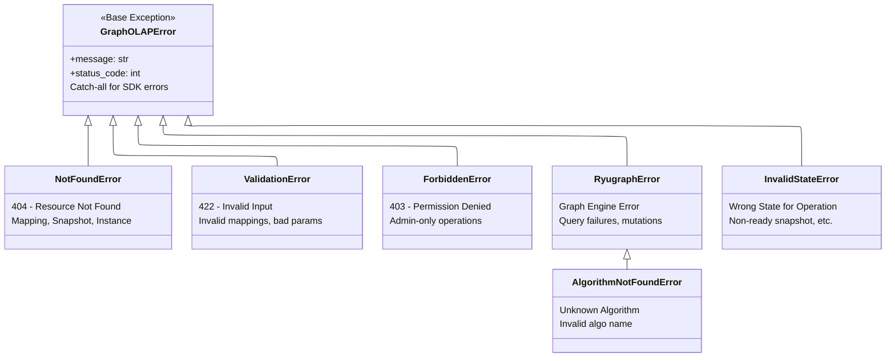
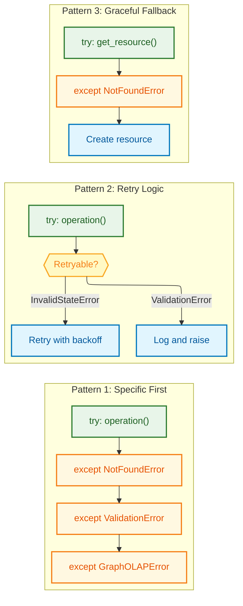
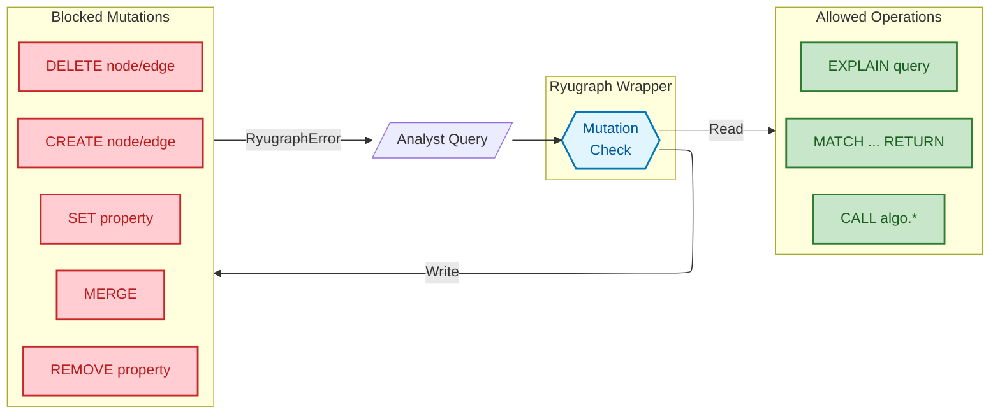

# Handling Errors

## Exception Hierarchy

Mermaid Source

```mermaid
---
config:
  layout: elk
---
classDiagram
    accTitle: Graph OLAP SDK Exception Hierarchy
    accDescr: Shows the inheritance structure of SDK exceptions from the base GraphOLAPError

    class GraphOLAPError {
        <<Base Exception>>
        +message: str
        +status_code: int
        Catch-all for SDK errors
    }

    class NotFoundError {
        404 - Resource Not Found
        Mapping, Snapshot, Instance
    }

    class ValidationError {
        422 - Invalid Input
        Invalid mappings, bad params
    }

    class ForbiddenError {
        403 - Permission Denied
        Admin-only operations
    }

    class RyugraphError {
        Graph Engine Error
        Query failures, mutations
    }

    class InvalidStateError {
        Wrong State for Operation
        Non-ready snapshot, etc.
    }

    class AlgorithmNotFoundError {
        Unknown Algorithm
        Invalid algo name
    }

    GraphOLAPError <|-- NotFoundError
    GraphOLAPError <|-- ValidationError
    GraphOLAPError <|-- ForbiddenError
    GraphOLAPError <|-- RyugraphError
    GraphOLAPError <|-- InvalidStateError
    RyugraphError <|-- AlgorithmNotFoundError
```

## Error Categories

Mermaid Source

```mermaid
---
config:
  layout: elk
---
flowchart TB
    accTitle: Error Categories
    accDescr: Shows the different categories of errors and when they occur

    classDef validation fill:#FFCDD2,stroke:#C62828,stroke-width:2px,color:#B71C1C
    classDef notfound fill:#FFF8E1,stroke:#F57F17,stroke-width:2px,color:#E65100
    classDef state fill:#E1F5FE,stroke:#0277BD,stroke-width:2px,color:#01579B
    classDef engine fill:#F3E5F5,stroke:#7B1FA2,stroke-width:2px,color:#4A148C

    subgraph Validation["Validation Errors (422)"]
        V1["Empty node label"]:::validation
        V2["Missing primary key"]:::validation
        V3["Edge refs missing node"]:::validation
        V4["Invalid property type"]:::validation
    end

    subgraph NotFound["Not Found Errors (404)"]
        N1["Mapping not found"]:::notfound
        N2["Snapshot not found"]:::notfound
        N3["Instance not found"]:::notfound
        N4["Algorithm not found"]:::notfound
    end

    subgraph State["State Errors"]
        S1["Snapshot not ready"]:::state
        S2["Instance not running"]:::state
        S3["Resource already deleted"]:::state
    end

    subgraph Engine["Engine Errors"]
        E1["Invalid Cypher syntax"]:::engine
        E2["Mutation blocked"]:::engine
        E3["Algorithm execution failed"]:::engine
        E4["Query timeout"]:::engine
    end
```

## Error Handling Patterns

Mermaid Source

```mermaid
---
config:
  layout: elk
---
flowchart LR
    accTitle: Error Handling Patterns
    accDescr: Shows recommended patterns for handling different error types in SDK code

    classDef code fill:#E8F5E9,stroke:#2E7D32,stroke-width:2px,color:#1B5E20
    classDef catch fill:#FFF8E1,stroke:#F57F17,stroke-width:2px,color:#E65100
    classDef handle fill:#E1F5FE,stroke:#0277BD,stroke-width:2px,color:#01579B
    classDef decision fill:#FFF9C4,stroke:#F9A825,stroke-width:2px,color:#F57F17

    subgraph Pattern1["Pattern 1: Specific First"]
        direction TB
        P1_Try["try: operation()"]:::code
        P1_C1["except NotFoundError"]:::catch
        P1_C2["except ValidationError"]:::catch
        P1_C3["except GraphOLAPError"]:::catch
        P1_Try --> P1_C1 --> P1_C2 --> P1_C3
    end

    subgraph Pattern2["Pattern 2: Retry Logic"]
        direction TB
        P2_Try["try: operation()"]:::code
        P2_Dec{{"Retryable?"}}:::decision
        P2_Retry["Retry with backoff"]:::handle
        P2_Fail["Log and raise"]:::handle
        P2_Try --> P2_Dec
        P2_Dec -->|"InvalidStateError"| P2_Retry
        P2_Dec -->|"ValidationError"| P2_Fail
    end

    subgraph Pattern3["Pattern 3: Graceful Fallback"]
        direction TB
        P3_Try["try: get_resource()"]:::code
        P3_404["except NotFoundError"]:::catch
        P3_Create["Create resource"]:::handle
        P3_Try --> P3_404 --> P3_Create
    end
```

## Mutation Blocking

Mermaid Source

```mermaid
---
config:
  layout: elk
---
flowchart LR
    accTitle: Mutation Blocking in Read-Only Instances
    accDescr: Shows how write operations are blocked on graph instances to maintain data integrity

    classDef query fill:#E8F5E9,stroke:#2E7D32,stroke-width:2px,color:#1B5E20
    classDef blocked fill:#FFCDD2,stroke:#C62828,stroke-width:2px,color:#B71C1C
    classDef allowed fill:#C8E6C9,stroke:#2E7D32,stroke-width:2px,color:#1B5E20
    classDef wrapper fill:#E1F5FE,stroke:#0277BD,stroke-width:2px,color:#01579B

    User[/"Analyst Query"/]

    subgraph Wrapper["Ryugraph Wrapper"]
        Check{{"Mutation<br/>Check"}}:::wrapper
    end

    subgraph Allowed["Allowed Operations"]
        MATCH["MATCH ... RETURN"]:::allowed
        CALL["CALL algo.*"]:::allowed
        EXPLAIN["EXPLAIN query"]:::allowed
    end

    subgraph Blocked["Blocked Mutations"]
        CREATE["CREATE node/edge"]:::blocked
        SET["SET property"]:::blocked
        DELETE["DELETE node/edge"]:::blocked
        MERGE["MERGE"]:::blocked
        REMOVE["REMOVE property"]:::blocked
    end

    User --> Check
    Check -->|"Read"| Allowed
    Check -->|"Write"| Blocked
    Blocked -->|"RyugraphError"| User
```

