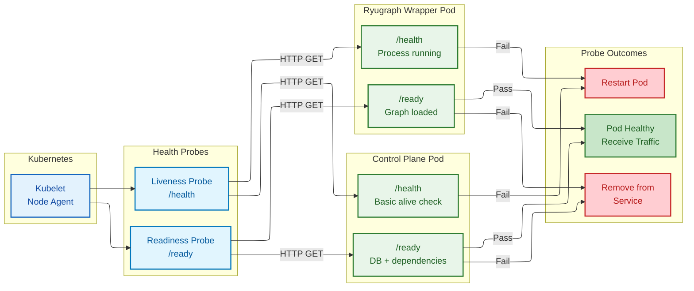

# Kubernetes Health Check Architecture

Mermaid Source

```mermaid
---
config:
  layout: elk
  elk:
    mergeEdges: false
    nodePlacementStrategy: BRANDES_KOEPF
---
flowchart LR
    accTitle: Kubernetes Health Check Architecture
    accDescr: Shows how Kubernetes kubelet probes Control Plane and Wrapper pods for liveness and readiness

    classDef infra fill:#E3F2FD,stroke:#1565C0,stroke-width:2px,color:#0D47A1
    classDef service fill:#E8F5E9,stroke:#2E7D32,stroke-width:2px,color:#1B5E20
    classDef process fill:#E1F5FE,stroke:#0277BD,stroke-width:2px,color:#01579B
    classDef success fill:#C8E6C9,stroke:#2E7D32,stroke-width:2px,color:#1B5E20
    classDef error fill:#FFCDD2,stroke:#C62828,stroke-width:2px,color:#B71C1C

    subgraph Kubernetes["Kubernetes"]
        direction TB
        Kubelet["Kubelet<br/>Node Agent"]:::infra
    end

    subgraph Probes["Health Probes"]
        direction TB
        Liveness["Liveness Probe<br/>/health"]:::process
        Readiness["Readiness Probe<br/>/ready"]:::process
    end

    subgraph ControlPlane["Control Plane Pod"]
        direction TB
        CP_Health["/health<br/>Basic alive check"]:::service
        CP_Ready["/ready<br/>DB + dependencies"]:::service
    end

    subgraph WrapperPod["Ryugraph Wrapper Pod"]
        direction TB
        WP_Health["/health<br/>Process running"]:::service
        WP_Ready["/ready<br/>Graph loaded"]:::service
    end

    subgraph Outcomes["Probe Outcomes"]
        direction TB
        Restart["Restart Pod"]:::error
        RemoveService["Remove from<br/>Service"]:::error
        Healthy["Pod Healthy<br/>Receive Traffic"]:::success
    end

    Kubelet --> Liveness
    Kubelet --> Readiness

    Liveness -->|"HTTP GET"| CP_Health
    Liveness -->|"HTTP GET"| WP_Health
    Readiness -->|"HTTP GET"| CP_Ready
    Readiness -->|"HTTP GET"| WP_Ready

    CP_Health -->|"Fail"| Restart
    WP_Health -->|"Fail"| Restart
    CP_Ready -->|"Fail"| RemoveService
    WP_Ready -->|"Fail"| RemoveService
    CP_Ready -->|"Pass"| Healthy
    WP_Ready -->|"Pass"| Healthy
```

