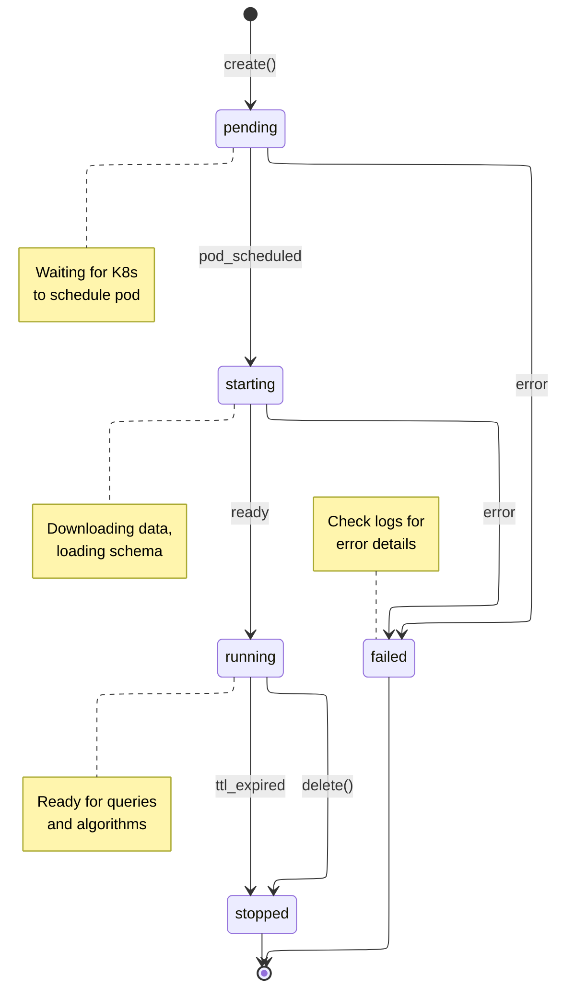
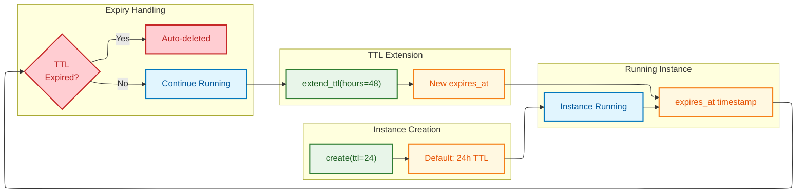
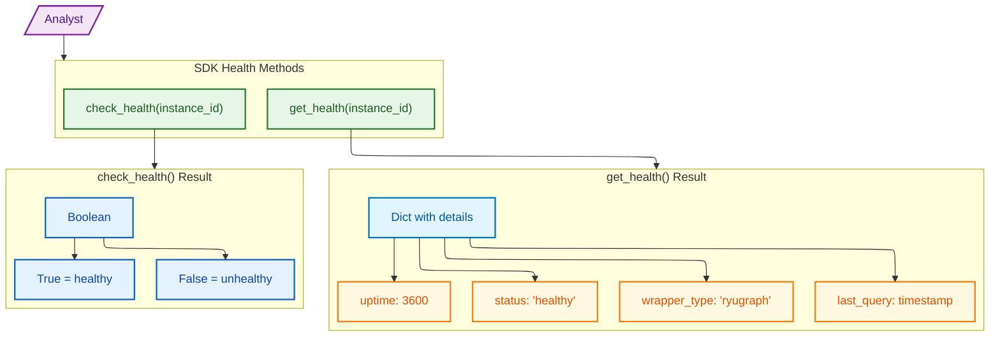
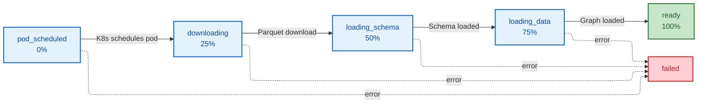
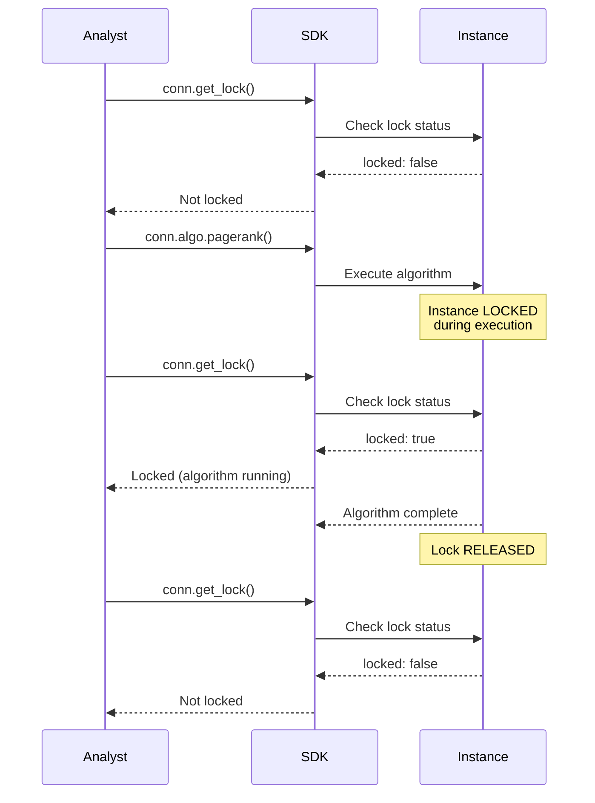

# Instance Lifecycle

## Instance State Machine

Mermaid Source

## TTL Management

Mermaid Source

## Health Check Architecture

Mermaid Source

## Instance Progress Phases

Mermaid Source

## Algorithm Lock Behavior

Mermaid Source

