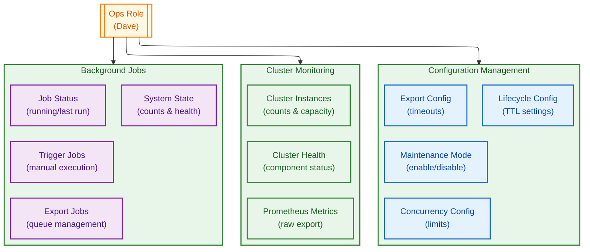
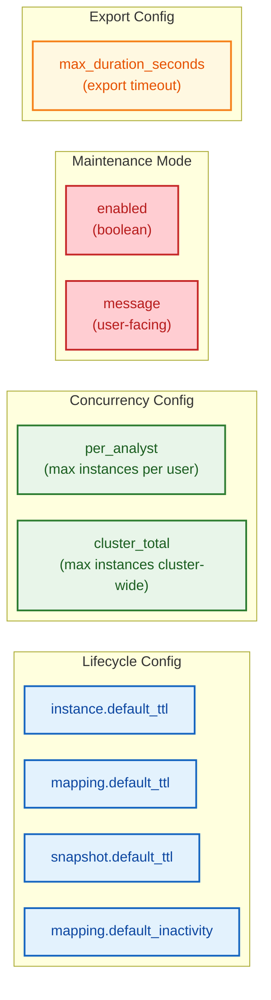
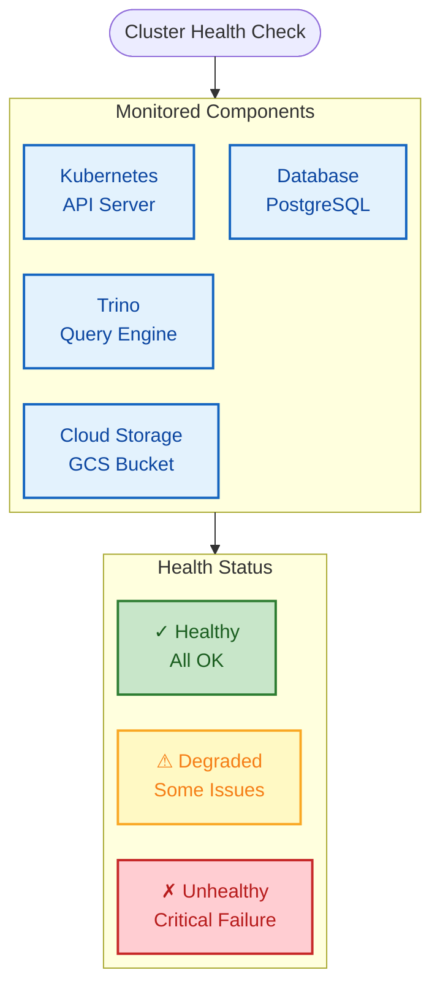
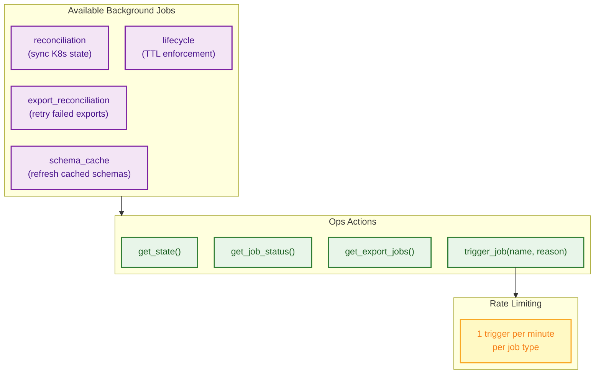
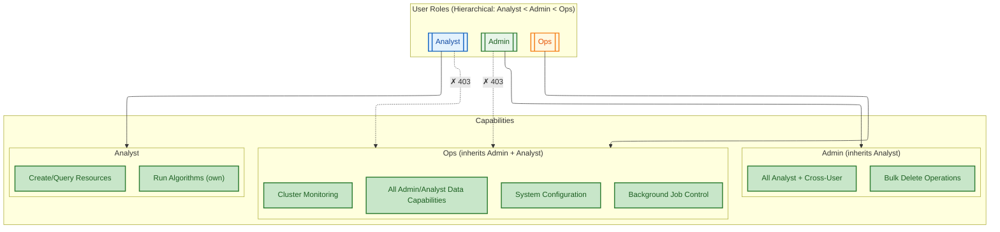

# Ops Configuration

## Ops Role Overview

Mermaid Source

## Configuration Categories

Mermaid Source

## Cluster Health Components

Mermaid Source

## Background Jobs

Mermaid Source

## Role Access Comparison

Mermaid Source

Roles are hierarchical: `Analyst < Admin < Ops`. Ops inherits all Admin and Analyst data capabilities (resource CRUD, cross-user access, bulk operations). Admin and Analyst cannot access Ops-only endpoints (configuration, cluster monitoring, background jobs). See [`../../system-design/authorization.spec.md`](../../system-design/authorization.spec.md) for the complete RBAC matrix.
