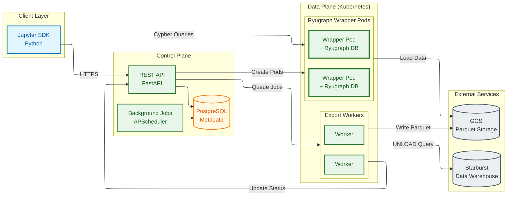

# Graph OLAP Platform Architecture

Mermaid Source

```mermaid
---
config:
  layout: elk
  elk:
    mergeEdges: false
    nodePlacementStrategy: BRANDES_KOEPF
---
flowchart LR
    accTitle: Graph OLAP Platform Architecture
    accDescr: Shows SDK connecting to Control Plane, which orchestrates Export Workers and Wrapper Pods for graph analytics

    %% Cagle Architecture Palette
    classDef user fill:#F3E5F5,stroke:#7B1FA2,stroke-width:2px,color:#4A148C
    classDef interface fill:#E1F5FE,stroke:#0277BD,stroke-width:2px,color:#01579B
    classDef service fill:#E8F5E9,stroke:#2E7D32,stroke-width:2px,color:#1B5E20
    classDef data fill:#FFF8E1,stroke:#F57F17,stroke-width:2px,color:#E65100
    classDef infra fill:#E3F2FD,stroke:#1565C0,stroke-width:2px,color:#0D47A1
    classDef external fill:#ECEFF1,stroke:#455A64,stroke-width:2px,color:#263238
    classDef wrapper fill:#E8F5E9,stroke:#2E7D32,stroke-width:3px,color:#1B5E20

    subgraph Client["Client Layer"]
        direction TB
        SDK["Jupyter SDK<br/>Python"]:::interface
    end

    subgraph ControlPlane["Control Plane"]
        direction TB
        API["REST API<br/>FastAPI"]:::service
        Jobs["Background Jobs<br/>APScheduler"]:::service
        PostgreSQL[("PostgreSQL<br/>Metadata")]:::data

        API --> PostgreSQL
        Jobs --> PostgreSQL
    end

    subgraph DataPlane["Data Plane (Kubernetes)"]
        direction TB
        subgraph Workers["Export Workers"]
            direction LR
            W1["Worker"]:::service
            W2["Worker"]:::service
        end

        subgraph Wrappers["Ryugraph Wrapper Pods"]
            direction LR
            WP1["Wrapper Pod<br/>+ Ryugraph DB"]:::wrapper
            WP2["Wrapper Pod<br/>+ Ryugraph DB"]:::wrapper
        end
    end

    subgraph External["External Services"]
        direction TB
        Starburst[("Starburst<br/>Data Warehouse")]:::external
        GCS[("GCS<br/>Parquet Storage")]:::external
    end

    %% Client connections
    SDK -->|"HTTPS"| API

    %% Control Plane orchestration
    API -->|"Create Pods"| Wrappers
    API -->|"Queue Jobs"| Workers

    %% Worker data flow
    Workers -->|"UNLOAD Query"| Starburst
    Workers -->|"Write Parquet"| GCS
    Workers -->|"Update Status"| API

    %% Wrapper data flow
    Wrappers -->|"Load Data"| GCS
    SDK -->|"Cypher Queries"| Wrappers
```

