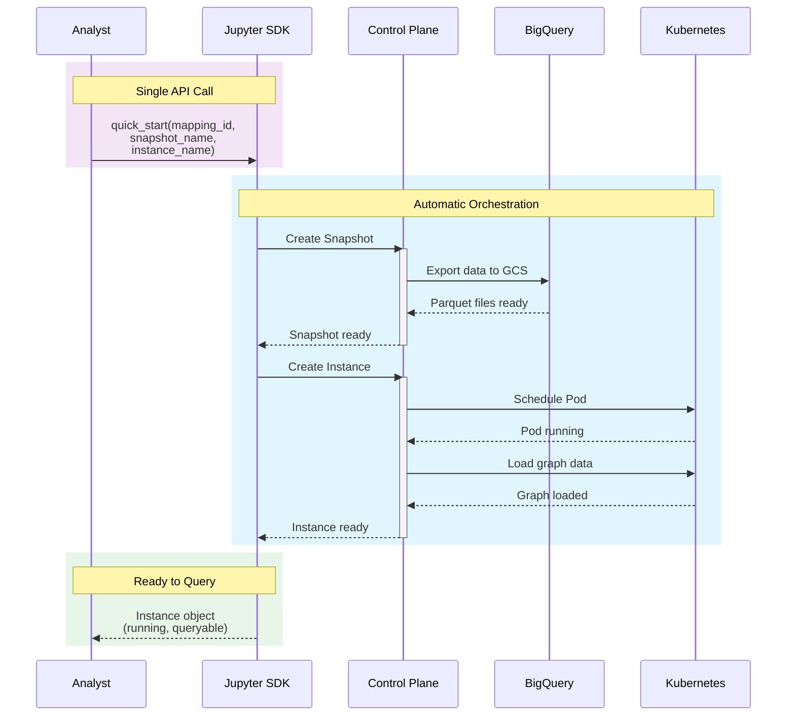
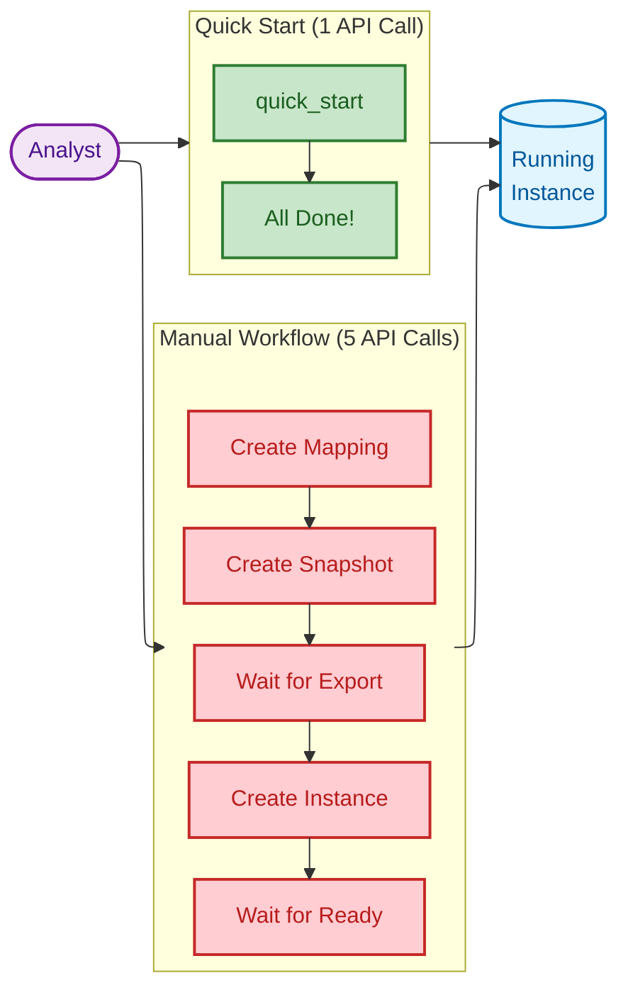

# Quick Start Workflow

## What quick_start() Does

Mermaid Source

```mermaid
---
config:
  layout: elk
---
sequenceDiagram
    accTitle: Quick Start Workflow
    accDescr: Shows what quick_start() does behind the scenes - creates snapshot and instance from mapping

    participant User as Analyst
    participant SDK as Jupyter SDK
    participant CP as Control Plane
    participant BQ as BigQuery
    participant K8s as Kubernetes

    rect rgb(243, 229, 245)
        Note over User,SDK: Single API Call
        User->>SDK: quick_start(mapping_id,<br/>snapshot_name,<br/>instance_name)
    end

    rect rgb(225, 245, 254)
        Note over SDK,K8s: Automatic Orchestration
        SDK->>CP: Create Snapshot
        activate CP
        CP->>BQ: Export data to GCS
        BQ-->>CP: Parquet files ready
        CP-->>SDK: Snapshot ready
        deactivate CP

        SDK->>CP: Create Instance
        activate CP
        CP->>K8s: Schedule Pod
        K8s-->>CP: Pod running
        CP->>K8s: Load graph data
        K8s-->>CP: Graph loaded
        CP-->>SDK: Instance ready
        deactivate CP
    end

    rect rgb(232, 245, 233)
        Note over User,SDK: Ready to Query
        SDK-->>User: Instance object<br/>(running, queryable)
    end
```

## Manual vs Quick Start Comparison

Mermaid Source

```mermaid
---
config:
  layout: elk
---
flowchart LR
    accTitle: Manual vs Quick Start Comparison
    accDescr: Shows the difference between manual resource creation and using quick_start()

    classDef user fill:#F3E5F5,stroke:#7B1FA2,stroke-width:2px,color:#4A148C
    classDef manual fill:#FFCDD2,stroke:#C62828,stroke-width:2px,color:#B71C1C
    classDef quick fill:#C8E6C9,stroke:#2E7D32,stroke-width:2px,color:#1B5E20
    classDef resource fill:#E1F5FE,stroke:#0277BD,stroke-width:2px,color:#01579B

    subgraph Manual["Manual Workflow (5 API Calls)"]
        direction TB
        M1[Create Mapping]:::manual
        M2[Create Snapshot]:::manual
        M3[Wait for Export]:::manual
        M4[Create Instance]:::manual
        M5[Wait for Ready]:::manual
        M1 --> M2 --> M3 --> M4 --> M5
    end

    subgraph Quick["Quick Start (1 API Call)"]
        direction TB
        Q1[quick_start]:::quick
        Q2[All Done!]:::quick
        Q1 --> Q2
    end

    User([Analyst]):::user
    Instance[(Running<br/>Instance)]:::resource

    User --> Manual
    User --> Quick
    Manual --> Instance
    Quick --> Instance
```

