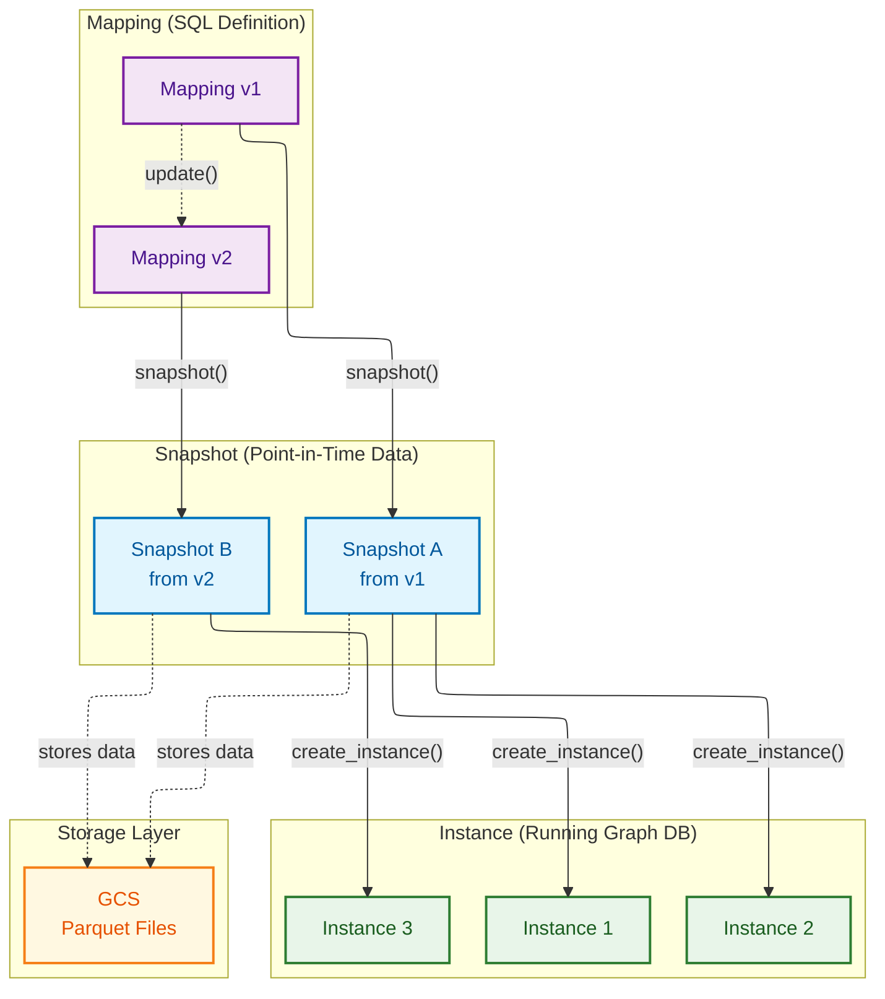
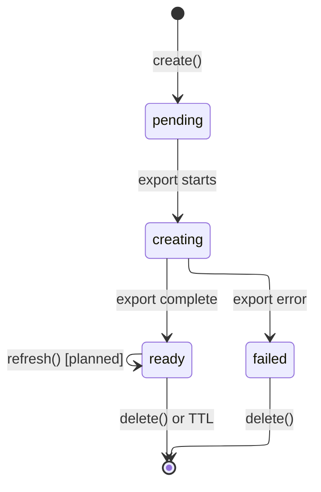
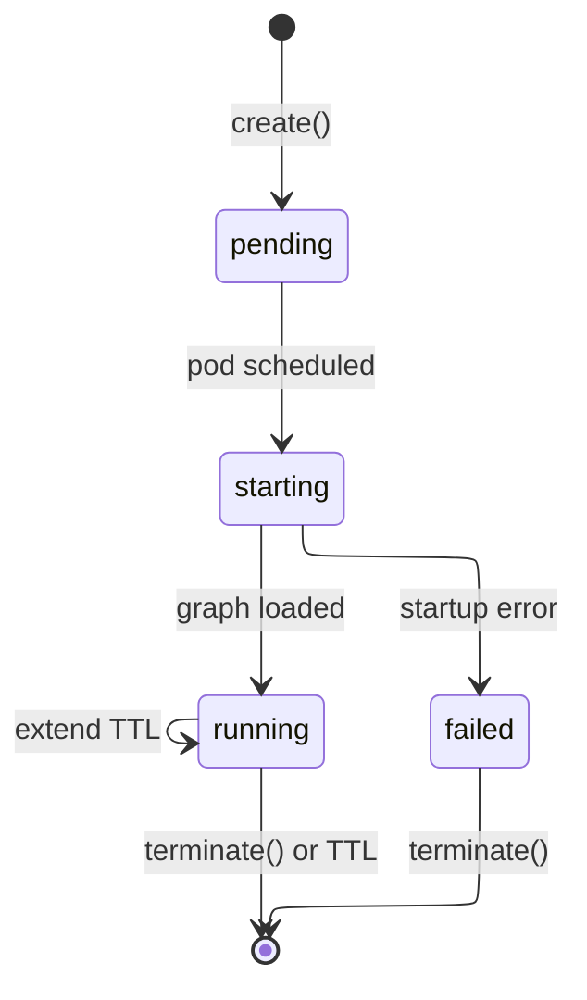

# Resource Hierarchy and Lifecycle

## Resource Hierarchy

Mermaid Source

```mermaid
---
config:
  layout: elk
---
flowchart TB
    accTitle: Graph OLAP Resource Hierarchy
    accDescr: Shows the parent-child relationship between Mappings, Snapshots, and Instances

    classDef mapping fill:#F3E5F5,stroke:#7B1FA2,stroke-width:2px,color:#4A148C
    classDef snapshot fill:#E1F5FE,stroke:#0277BD,stroke-width:2px,color:#01579B
    classDef instance fill:#E8F5E9,stroke:#2E7D32,stroke-width:2px,color:#1B5E20
    classDef data fill:#FFF8E1,stroke:#F57F17,stroke-width:2px,color:#E65100

    subgraph MappingLayer["Mapping (SQL Definition)"]
        direction LR
        M1["Mapping v1"]:::mapping
        M2["Mapping v2"]:::mapping
        M1 -.->|"update()"| M2
    end

    subgraph SnapshotLayer["Snapshot (Point-in-Time Data)"]
        direction LR
        S1["Snapshot A<br/>from v1"]:::snapshot
        S2["Snapshot B<br/>from v2"]:::snapshot
    end

    subgraph InstanceLayer["Instance (Running Graph DB)"]
        direction LR
        I1["Instance 1"]:::instance
        I2["Instance 2"]:::instance
        I3["Instance 3"]:::instance
    end

    subgraph Storage["Storage Layer"]
        GCS["GCS<br/>Parquet Files"]:::data
    end

    M1 -->|"snapshot()"| S1
    M2 -->|"snapshot()"| S2
    S1 -->|"create_instance()"| I1
    S1 -->|"create_instance()"| I2
    S2 -->|"create_instance()"| I3
    S1 -.->|"stores data"| GCS
    S2 -.->|"stores data"| GCS
```

## Snapshot State Machine

Mermaid Source

```mermaid
---
config:
  layout: elk
---
stateDiagram-v2
    accTitle: Snapshot Lifecycle States
    accDescr: Shows state transitions for snapshots from creation to deletion

    [*] --> pending: create()
    pending --> creating: export starts
    creating --> ready: export complete
    creating --> failed: export error
    ready --> [*]: delete() or TTL
    failed --> [*]: delete()
    ready --> ready: refresh() [planned]
```

## Instance State Machine

Mermaid Source

```mermaid
---
config:
  layout: elk
---
stateDiagram-v2
    accTitle: Instance Lifecycle States
    accDescr: Shows state transitions for graph instances from creation to termination

    [*] --> pending: create()
    pending --> starting: pod scheduled
    starting --> running: graph loaded
    starting --> failed: startup error
    running --> running: extend TTL
    running --> [*]: terminate() or TTL
    failed --> [*]: terminate()
```

