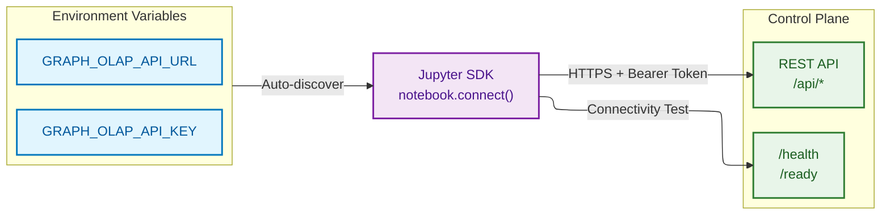

# SDK Connection Flow

Mermaid Source

```mermaid
---
config:
  layout: elk
---
flowchart LR
    accTitle: SDK Connection Flow
    accDescr: Shows how the Jupyter SDK connects to the Control Plane API

    classDef client fill:#F3E5F5,stroke:#7B1FA2,stroke-width:2px,color:#4A148C
    classDef service fill:#E8F5E9,stroke:#2E7D32,stroke-width:2px,color:#1B5E20
    classDef env fill:#E1F5FE,stroke:#0277BD,stroke-width:2px,color:#01579B

    subgraph Environment["Environment Variables"]
        direction TB
        URL["GRAPH_OLAP_API_URL"]:::env
        KEY["GRAPH_OLAP_API_KEY"]:::env
    end

    SDK["Jupyter SDK<br/>notebook.connect()"]:::client

    subgraph ControlPlane["Control Plane"]
        API["REST API<br/>/api/*"]:::service
        Health["/health<br/>/ready"]:::service
    end

    Environment -->|"Auto-discover"| SDK
    SDK -->|"HTTPS + Bearer Token"| API
    SDK -->|"Connectivity Test"| Health
```

