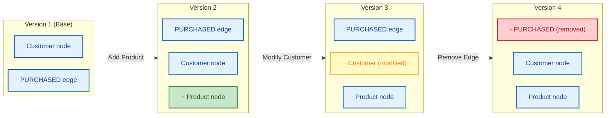
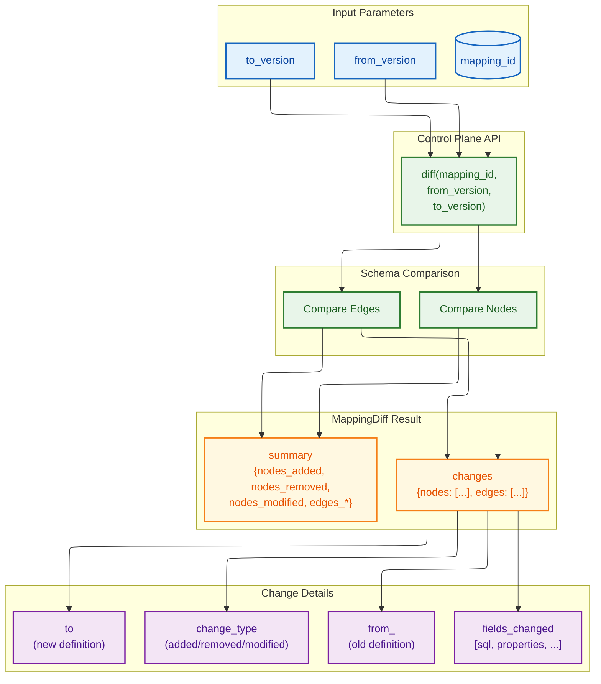
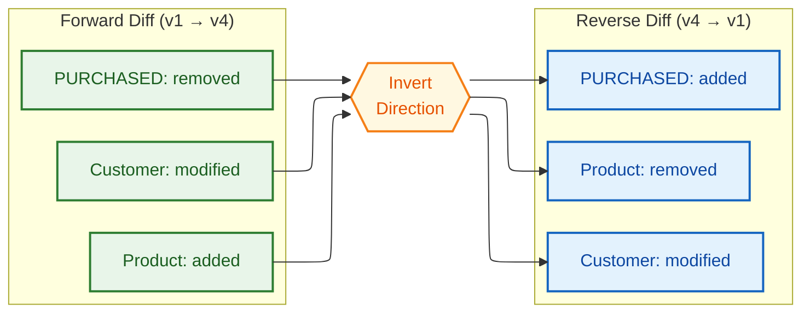
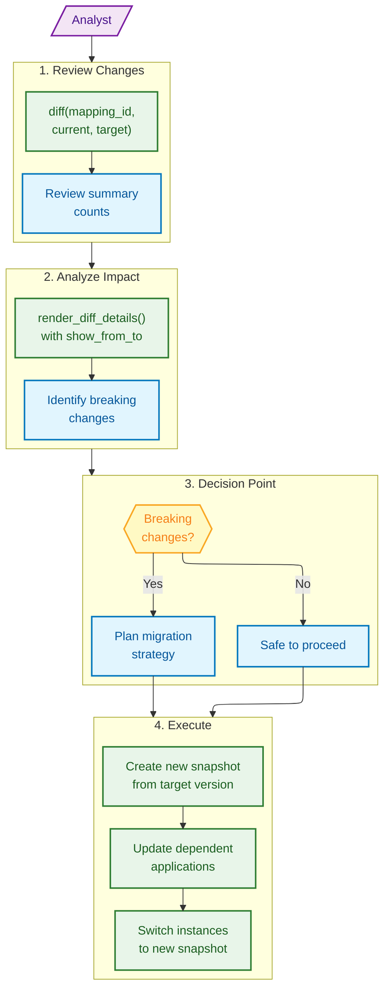

# Version Diffing

## Version Evolution Timeline

Mermaid Source

## Diff Operation Flow

Mermaid Source

## Change Types Matrix

```mermaid
---
config:
  layout: elk
---
flowchart TB
    accTitle: Change Types Matrix
    accDescr: Shows the three change types and their from/to/fields_changed values

    classDef added fill:#C8E6C9,stroke:#2E7D32,stroke-width:2px,color:#1B5E20
    classDef removed fill:#FFCDD2,stroke:#C62828,stroke-width:2px,color:#B71C1C
    classDef modified fill:#FFF9C4,stroke:#F9A825,stroke-width:2px,color:#F57F17
    classDef field fill:#E1F5FE,stroke:#0277BD,stroke-width:2px,color:#01579B

    subgraph Added["change_type: added"]
        A1["from_: None"]:::field
        A2["to: {definition}"]:::field
        A3["fields_changed: None"]:::field
    end
    A["New element<br/>not in from_version"]:::added --> Added

    subgraph Removed["change_type: removed"]
        R1["from_: {definition}"]:::field
        R2["to: None"]:::field
        R3["fields_changed: None"]:::field
    end
    R["Element removed<br/>not in to_version"]:::removed --> Removed

    subgraph Modified["change_type: modified"]
        M1["from_: {old definition}"]:::field
        M2["to: {new definition}"]:::field
        M3["fields_changed: [...]"]:::field
    end
    M["Element changed<br/>between versions"]:::modified --> Modified
```

Mermaid Source

## Reverse Diff Behavior

Mermaid Source

## Migration Planning Workflow

Mermaid Source

