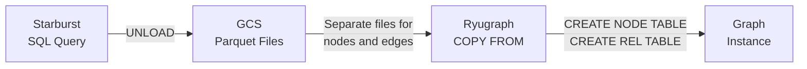

# Data Pipeline Reference

Technical reference for the Starburst Galaxy → Parquet → Ryugraph data pipeline.

## Overview

This document details how relational data flows from **Starburst Galaxy** (managed Trino SaaS) SQL queries through Parquet files into Ryugraph/KuzuDB graph structures. It documents **external system behaviour** that our components depend on.

**References:**
- [ADR-070: Starburst Galaxy + BigQuery Export Platform](../process/adr/infrastructure/adr-070-starburst-galaxy-bigquery-export.md)
- [ADR-071: PyArrow Fallback Export Strategy](../process/adr/system-design/adr-071-pyarrow-fallback-export.md)

**Related documents:**

- [requirements.md](../foundation/requirements.md) - Mapping definition JSON schema (authoritative source)
- [export-worker.design.md](../component-designs/export-worker.design.md) - How our worker executes exports
- [ryugraph-wrapper.design.md](../component-designs/ryugraph-wrapper.design.md) - How our wrapper loads graphs
- [control-plane.design.md#mapping-generator-subsystem](../component-designs/control-plane.design.md#mapping-generator-subsystem) - How we validate mappings

---

## Data Flow Pipeline


<details>
<summary>Mermaid Source</summary>



</details>

---

## Two-Tier Export Strategy

The platform implements a two-tier export strategy with automatic fallback:

| Tier | Method | When Used | Characteristics |
|------|--------|-----------|-----------------|
| **1 (Primary)** | Server-side (`system.unload()`) | Starburst Galaxy with GCS catalog | Distributed execution, direct GCS write |
| **2 (Fallback)** | Client-side (PyArrow) | When server-side unavailable | Streams through export worker, memory buffered |

### Export Flow with Fallback

```
Export Worker → Starburst Galaxy
                    │
        ┌───────────┴───────────┐
        │                       │
        ▼                       ▼
  system.unload()          SELECT * (fallback)
        │                       │
        │                       ▼
        │               Export Worker
        │                       │
        │                       ▼
        │                   PyArrow
        │                       │
        └───────────┬───────────┘
                    ▼
                   GCS
```

### Fallback Triggers

The system falls back to PyArrow when:
- `system.unload()` is not available
- GCS catalog is not configured
- Feature flag is disabled
- Permission errors occur

### Memory Considerations (Fallback Path)

| Dataset Size | Memory Required | Recommendation |
|--------------|-----------------|----------------|
| < 100 MB | 256 MB | Safe for fallback |
| 100 MB - 1 GB | 1-2 GB | Monitor closely |
| > 1 GB | 2+ GB | Prefer server-side |

---

## Starburst Galaxy UNLOAD

### Syntax

The `UNLOAD` table function exports query results directly to GCS:

```sql
SELECT * FROM TABLE(
    io.unload(
        input => TABLE(
            SELECT customer_id, name, city, signup_date
            FROM analytics.customers
        ),
        location => 'gs://bucket/{user_id}/{mapping_id}/{snapshot_id}/nodes/customers/',
        format => 'PARQUET',
        compression => 'SNAPPY'
    )
)
```

**Parameters:**

| Parameter | Required | Description |
|-----------|----------|-------------|
| input | Yes | TABLE(...) containing the SELECT query |
| location | Yes | GCS destination path |
| format | Yes | Output format (use 'PARQUET') |
| compression | No | Compression codec (recommend 'SNAPPY') |

### Parallel Writing Behaviour

Starburst writes in parallel **without** partitioning. Multiple worker nodes each produce their own output files:

```
gs://bucket/snapshot/nodes/customers/
├── 00000-123-uuid1-0-00001.parquet  ← worker 1
├── 00000-124-uuid2-0-00001.parquet  ← worker 2
├── 00000-125-uuid3-0-00001.parquet  ← worker 3
└── 00000-126-uuid4-0-00001.parquet  ← worker 4
```

**File naming pattern:** `{sequence}-{task}-{UUID}-{split}-{part}.parquet`

The number of files depends on cluster size and data volume. For typical ≤2GB graphs, this produces a manageable number of files.

### Column Ordering Requirements

The Parquet schema is controlled entirely by the SELECT query. **Column ordering is critical:**

- For nodes: primary_key must be first column
- For edges: from_key, to_key must be first two columns
- Properties follow in defined order

```sql
SELECT * FROM TABLE(
    io.unload(
        input => TABLE(
            SELECT
                customer_id,                              -- Primary key (must be first)
                name,                                     -- Property
                CAST(balance AS DOUBLE) as balance,       -- Cast DECIMAL to DOUBLE
                signup_date                               -- Property
            FROM analytics.customers
        ),
        location => 'gs://bucket/path/nodes/customers/',
        format => 'PARQUET',
        compression => 'SNAPPY'
    )
)
```

---

## Ryugraph Schema

### Node Table Definition

```cypher
CREATE NODE TABLE Customer(
    customer_id STRING PRIMARY KEY,
    name STRING,
    city STRING,
    signup_date DATE
);
```

**Rules:**

- Every node table requires a `PRIMARY KEY`
- Primary key must be unique across all nodes of that type
- Supported PK types: STRING, INT64, DATE, UUID

### Relationship Table Definition

```cypher
CREATE REL TABLE PURCHASED(
    FROM Customer TO Product,
    purchase_date DATE,
    amount DOUBLE,
    quantity INT64
);
```

**Rules:**

- Must specify `FROM NodeTable TO NodeTable`
- First two columns in Parquet must be FROM and TO primary keys
- Relationship properties follow the FROM/TO columns

### Multi-Source/Target Relationships

```cypher
CREATE REL TABLE REVIEWED(
    FROM Customer TO Product,
    FROM Customer TO Merchant,
    rating INT64,
    review_text STRING
);
```

When importing, specify which pair:

```cypher
COPY REVIEWED FROM 'customer_product_reviews.parquet' (from='Customer', to='Product');
COPY REVIEWED FROM 'customer_merchant_reviews.parquet' (from='Customer', to='Merchant');
```

> **Design decision:** Our mapping schema does not currently support multi-source/target relationships. Each edge definition connects exactly one `from_node` to one `to_node`. For polymorphic relationships, define separate edge types (e.g., `REVIEWED_PRODUCT`, `REVIEWED_MERCHANT`). This simplifies validation, export, and import logic. Revisit if analysts need to query across polymorphic endpoints as a single relationship type—would require allowing multiple edge definitions with the same `type` and identical `properties`.

### Multiplicity Constraints

```cypher
-- Each customer has at most one primary address
CREATE REL TABLE HAS_PRIMARY_ADDRESS(FROM Customer TO Address, MANY_ONE);

-- One-to-one marriage relationship
CREATE REL TABLE MARRIED_TO(FROM Person TO Person, ONE_ONE);
```

> **Design decision:** Our mapping schema does not support multiplicity constraints. All relationships use the default `MANY_MANY`. Since our graphs are read-only analytics snapshots (no inserts/updates after initial load), cardinality enforcement provides no benefit—the source data already defines the actual cardinality.

---

## Parquet File Requirements

### Node Table Parquet Structure

For a node table:

```cypher
CREATE NODE TABLE Customer(
    customer_id STRING PRIMARY KEY,
    name STRING,
    age INT64,
    city STRING
);
```

**Parquet columns must be in exact order:**

| Column | Type | Notes |
|--------|------|-------|
| customer_id | STRING | Primary key (required, first) |
| name | STRING | Property |
| age | INT64 | Property |
| city | STRING | Property |

### Relationship Table Parquet Structure

For a relationship table:

```cypher
CREATE REL TABLE PURCHASED(
    FROM Customer TO Product,
    purchase_date DATE,
    amount DOUBLE
);
```

**Parquet columns must be:**

| Column | Type | Notes |
|--------|------|-------|
| customer_id | STRING | FROM node primary key (required, first) |
| product_id | STRING | TO node primary key (required, second) |
| purchase_date | DATE | Relationship property |
| amount | DOUBLE | Relationship property |

### SERIAL Primary Keys (Auto-Increment)

For large datasets with sequential IDs:

```cypher
CREATE NODE TABLE Event(
    id SERIAL PRIMARY KEY,
    event_type STRING,
    timestamp TIMESTAMP
);
```

**When using SERIAL:**

- **Omit the primary key column from Parquet file**
- Ryugraph auto-generates IDs starting from 0
- Significantly improves load performance

Parquet columns for SERIAL node:

| Column | Type |
|--------|------|
| event_type | STRING |
| timestamp | TIMESTAMP |

> **Design decision:** Our mapping schema does not support SERIAL primary keys. We always use the source database primary key to maintain traceability between graph nodes and source data. At our target scale (≤2GB graphs, ~10M nodes max), the performance benefit of SERIAL is negligible. SERIAL would also complicate edge definitions since edges reference nodes by primary key, and auto-generated IDs aren't known until after node import. Revisit if scale increases significantly (50M+ nodes)—SERIAL provides fastest graph traversal via sequential INT64 keys with optimal memory layout and cache locality.

---

## Ryugraph COPY FROM

### Syntax

```cypher
COPY TableName FROM 'gs://bucket/path/*.parquet';
```

### Import Order Constraint

**Critical:** Always import nodes before relationships. Relationships reference node primary keys that must already exist.

```cypher
-- STEP 1: Import nodes FIRST (order matters!)
COPY Customer FROM 'gs://bucket/snapshot_123/nodes/customers/*.parquet';
COPY Product FROM 'gs://bucket/snapshot_123/nodes/products/*.parquet';

-- STEP 2: Import relationships AFTER nodes exist
COPY PURCHASED FROM 'gs://bucket/snapshot_123/edges/purchased/*.parquet';
```

### Glob Pattern Support

Ryugraph reads all matching files via glob pattern:

```cypher
COPY Customer FROM 'gs://bucket/path/*.parquet';  -- reads all parquet files
```

---

## Type Mapping

### Starburst to Ryugraph Type Mapping

| Starburst/Trino Type | Ryugraph Type | Notes |
|---------------------|---------------|-------|
| VARCHAR, CHAR | STRING | UTF-8 encoded |
| BIGINT | INT64 | 64-bit signed integer |
| INTEGER | INT32 | 32-bit signed integer |
| SMALLINT | INT16 | 16-bit signed integer |
| TINYINT | INT8 | 8-bit signed integer |
| DOUBLE | DOUBLE | 64-bit floating point |
| REAL | FLOAT | 32-bit floating point |
| DECIMAL | DOUBLE | Cast in SQL query |
| DATE | DATE | Calendar date |
| TIMESTAMP | TIMESTAMP | Date and time |
| TIMESTAMP WITH TIME ZONE | TIMESTAMP | Timezone stripped |
| BOOLEAN | BOOL | True/false |
| VARBINARY | BLOB | Binary data |
| ARRAY | LIST | Variable-length array |
| MAP | MAP | Key-value pairs |
| ROW | STRUCT | Structured type |
| UUID | UUID | Universal identifier |

### Required SQL Casts

Some types require explicit casting in the SQL query:

```sql
SELECT
    customer_id,
    name,
    CAST(price AS DOUBLE) as price,           -- DECIMAL -> DOUBLE
    CAST(created_at AS TIMESTAMP) as created, -- Handle timezone
    CAST(is_active AS BOOLEAN) as is_active   -- Ensure boolean
FROM source_table
```

---

## Error Handling

### Duplicate Primary Keys

Ryugraph rejects duplicate primary keys by default:

```cypher
-- Enable error skipping for dirty data
COPY Customer FROM 'file.parquet' (IGNORE_ERRORS=true);
```

**Note:** `IGNORE_ERRORS=true` has performance cost. Prefer clean data.

### Missing Foreign Keys

Relationships referencing non-existent nodes will fail:

```
Error: Node with primary key 'customer_xyz' not found in Customer table
```

**Solution:** Always load nodes before relationships.

### Schema Mismatch

Parquet columns must match Ryugraph schema exactly:

```
Error: Column count mismatch. Expected 4 columns, got 3.
```

**Solution:** Ensure SELECT column order matches CREATE TABLE property order.

---

## Performance Considerations

### Parallel I/O

| Stage | Parallelism | How |
|-------|-------------|-----|
| Starburst UNLOAD | Multiple workers write files concurrently | Automatic based on cluster size |
| Ryugraph COPY FROM | Multiple threads read files concurrently | `max_num_threads` setting |

**Both parallel write and parallel read work without partitioning.** The flat file structure is optimal:

```
gs://bucket/snapshot/nodes/customers/
├── file-001.parquet  ← written by worker 1, read by thread A
├── file-002.parquet  ← written by worker 2, read by thread B
├── file-003.parquet  ← written by worker 3, read by thread C
└── ...
```

### Starburst Export Tuning

- Use `compression => 'SNAPPY'` for balance of speed and size
- Files are automatically parallelised across workers
- No partitioning needed for performance

### Ryugraph Import Tuning

- **COPY FROM is fastest** for bulk loading (vs individual inserts)
- Use glob patterns: `COPY FROM 'path/*.parquet'` to read all files
- Ryugraph reads multiple files in parallel using available threads
- Set buffer pool appropriately: `buffer_pool_size=2_147_483_648` (2GB)
- For consecutive integer IDs, use `SERIAL` and omit PK column

### Memory Management

For large graphs (approaching 2GB limit):

- Configure Ryugraph buffer pool to ~80% of pod memory
- Enable disk spilling for larger-than-memory operations
- Use persistent volume for spill files

---

## Mapping Many-to-Many Relationships

In relational databases, many-to-many relationships are represented using **join tables** with foreign keys to both entities. In the graph model, these become **relationship tables with properties**.

### Relational Pattern

```sql
-- Join table with foreign keys to both entities
CREATE TABLE transactions (
    transaction_id VARCHAR PRIMARY KEY,
    customer_id VARCHAR REFERENCES customers(customer_id),
    product_id VARCHAR REFERENCES products(product_id),
    amount DECIMAL(10,2),
    transaction_date TIMESTAMP
);
```

### Graph Pattern

```cypher
-- Foreign keys become FROM/TO, other columns become properties
CREATE REL TABLE PURCHASED(
    FROM Customer TO Product,
    transaction_id STRING,
    amount DOUBLE,
    transaction_date TIMESTAMP
);
```

### Mapping Rules

| Relational Concept | Graph Equivalent |
|--------------------|------------------|
| Join table | REL TABLE |
| FK to source entity | FROM NodeType |
| FK to target entity | TO NodeType |
| Other columns | Relationship properties |
| Join table PK | Optional property (or omit if not needed) |

### Export Query Structure

**Critical:** Column ordering determines the relationship direction.

```sql
SELECT
    customer_id,           -- FROM node PK (must be first)
    product_id,            -- TO node PK (must be second)
    transaction_id,        -- Property
    CAST(amount AS DOUBLE) as amount,
    transaction_date
FROM transactions
```

### Import Order

Always load **both node tables before** the relationship table:

```cypher
-- 1. Load nodes first
COPY Customer FROM 'gs://bucket/nodes/Customer/*.parquet';
COPY Product FROM 'gs://bucket/nodes/Product/*.parquet';

-- 2. Load relationships after nodes exist
COPY PURCHASED FROM 'gs://bucket/edges/PURCHASED/*.parquet';
```

---

## Complete Example

### Source: Relational Schema (in Starburst)

```sql
-- Customers table
CREATE TABLE customers (
    customer_id VARCHAR PRIMARY KEY,
    name VARCHAR,
    email VARCHAR,
    city VARCHAR,
    signup_date DATE
);

-- Products table
CREATE TABLE products (
    product_id VARCHAR PRIMARY KEY,
    name VARCHAR,
    category VARCHAR,
    price DECIMAL(10,2)
);

-- Transactions table (join table with attributes)
CREATE TABLE transactions (
    transaction_id VARCHAR PRIMARY KEY,
    customer_id VARCHAR REFERENCES customers(customer_id),
    product_id VARCHAR REFERENCES products(product_id),
    amount DECIMAL(10,2),
    transaction_date TIMESTAMP
);
```

### Target: Graph Schema (in Ryugraph)

```cypher
-- Node tables
CREATE NODE TABLE Customer(
    customer_id STRING PRIMARY KEY,
    name STRING,
    email STRING,
    city STRING,
    signup_date DATE
);

CREATE NODE TABLE Product(
    product_id STRING PRIMARY KEY,
    name STRING,
    category STRING,
    price DOUBLE
);

-- Relationship table (foreign keys become explicit edges)
CREATE REL TABLE PURCHASED(
    FROM Customer TO Product,
    transaction_id STRING,
    amount DOUBLE,
    transaction_date TIMESTAMP
);
```

### Export Queries

```sql
-- Export Customers
SELECT * FROM TABLE(io.unload(
    input => TABLE(
        SELECT customer_id, name, email, city, signup_date
        FROM analytics.customers
    ),
    location => 'gs://bucket/snapshot_123/nodes/Customer/',
    format => 'PARQUET',
    compression => 'SNAPPY'
))

-- Export Products
SELECT * FROM TABLE(io.unload(
    input => TABLE(
        SELECT product_id, name, category, CAST(price AS DOUBLE) as price
        FROM analytics.products
    ),
    location => 'gs://bucket/snapshot_123/nodes/Product/',
    format => 'PARQUET',
    compression => 'SNAPPY'
))

-- Export PURCHASED relationships
SELECT * FROM TABLE(io.unload(
    input => TABLE(
        SELECT
            t.customer_id,           -- FROM node PK (first)
            t.product_id,            -- TO node PK (second)
            t.transaction_id,        -- Property
            CAST(t.amount AS DOUBLE) as amount,
            t.transaction_date
        FROM analytics.transactions t
    ),
    location => 'gs://bucket/snapshot_123/edges/PURCHASED/',
    format => 'PARQUET',
    compression => 'SNAPPY'
))
```

### Import Commands

```cypher
-- Create schema
CREATE NODE TABLE Customer(customer_id STRING PRIMARY KEY, name STRING, email STRING, city STRING, signup_date DATE);
CREATE NODE TABLE Product(product_id STRING PRIMARY KEY, name STRING, category STRING, price DOUBLE);
CREATE REL TABLE PURCHASED(FROM Customer TO Product, transaction_id STRING, amount DOUBLE, transaction_date TIMESTAMP);

-- Import nodes first
COPY Customer FROM 'gs://bucket/snapshot_123/nodes/Customer/*.parquet';
COPY Product FROM 'gs://bucket/snapshot_123/nodes/Product/*.parquet';

-- Import relationships after nodes exist
COPY PURCHASED FROM 'gs://bucket/snapshot_123/edges/PURCHASED/*.parquet';
```

### GCS File Structure

```
gs://bucket/snapshot_123/
├── nodes/
│   ├── Customer/
│   │   ├── 00000-xxx-uuid1.parquet
│   │   └── 00000-xxx-uuid2.parquet
│   └── Product/
│       └── 00000-xxx-uuid3.parquet
└── edges/
    └── PURCHASED/
        ├── 00000-xxx-uuid4.parquet
        └── 00000-xxx-uuid5.parquet
```

---

## Starburst/Trino REST API Protocol

This section documents the Starburst REST API used for async query execution. Reference: [Trino Client Protocol](https://trino.io/docs/current/develop/client-protocol.html).

### Query Submission

Submit a query via POST to `/v1/statement`:

```http
POST /v1/statement HTTP/1.1
Host: starburst.example.com
X-Trino-Catalog: analytics
X-Trino-Schema: public
Content-Type: text/plain
Authorization: Basic <base64>

SELECT * FROM TABLE(io.unload(...))
```

**Response (success):**

```json
{
  "id": "20250116_123456_00001_abcde",
  "infoUri": "http://starburst:8080/ui/query/20250116_123456_00001_abcde",
  "nextUri": "http://starburst:8080/v1/query/20250116_123456_00001_abcde/1",
  "stats": {
    "state": "QUEUED",
    "queued": true,
    "scheduled": false,
    "nodes": 0,
    "totalSplits": 0,
    "queuedSplits": 0,
    "runningSplits": 0,
    "completedSplits": 0
  }
}
```

**Response (immediate error):**

```json
{
  "id": "20250116_123456_00001_abcde",
  "stats": {"state": "FAILED"},
  "error": {
    "message": "line 1:1: Table 'analytics.public.invalid' does not exist",
    "errorCode": 1,
    "errorName": "TABLE_NOT_FOUND",
    "errorType": "USER_ERROR"
  }
}
```

### Query Polling

Poll query status via GET to the `nextUri`:

```http
GET /v1/query/20250116_123456_00001_abcde/1 HTTP/1.1
Host: starburst.example.com
Authorization: Basic <base64>
```

**Response (in progress):**

```json
{
  "id": "20250116_123456_00001_abcde",
  "nextUri": "http://starburst:8080/v1/query/20250116_123456_00001_abcde/2",
  "stats": {
    "state": "RUNNING",
    "queued": false,
    "scheduled": true,
    "nodes": 4,
    "totalSplits": 100,
    "queuedSplits": 20,
    "runningSplits": 30,
    "completedSplits": 50
  }
}
```

**Response (finished - no nextUri):**

```json
{
  "id": "20250116_123456_00001_abcde",
  "stats": {
    "state": "FINISHED",
    "queued": false,
    "scheduled": true,
    "nodes": 4,
    "totalSplits": 100,
    "queuedSplits": 0,
    "runningSplits": 0,
    "completedSplits": 100
  }
}
```

**Response (failed):**

```json
{
  "id": "20250116_123456_00001_abcde",
  "stats": {"state": "FAILED"},
  "error": {
    "message": "Query exceeded maximum time limit of 1.00h",
    "errorCode": 65540,
    "errorName": "EXCEEDED_TIME_LIMIT",
    "errorType": "USER_ERROR"
  }
}
```

### Query State Machine

```
     QUEUED
        ↓
    PLANNING
        ↓
    STARTING
        ↓
     RUNNING  ────→  FAILED
        ↓
   FINISHING
        ↓
    FINISHED
```

**State descriptions:**

| State | Description |
|-------|-------------|
| `QUEUED` | Query waiting in queue |
| `PLANNING` | Query plan being generated |
| `STARTING` | Allocating resources |
| `RUNNING` | Executing on workers |
| `FINISHING` | Completing final operations |
| `FINISHED` | Query completed successfully |
| `FAILED` | Query failed (check `error` field) |

### Protocol Rules

1. **Completion detection**: Keep polling `nextUri` until it's **absent** from the response. The `state` field is for humans only.

2. **HTTP error handling**:
   | Status | Action |
   |--------|--------|
   | 200 | Process response |
   | 429 | Retry after `Retry-After` header |
   | 502, 503, 504 | Retry in 50-100ms (load balancer issue) |
   | Other | Query failed |

3. **Authentication**: Headers only required on initial POST, not when following `nextUri`.

4. **Query cancellation**: Send `DELETE` to `nextUri` to cancel a running query.

### Required Headers

| Header | Required | Description |
|--------|----------|-------------|
| `X-Trino-Catalog` | Yes (POST) | Default catalog |
| `X-Trino-Schema` | Yes (POST) | Default schema |
| `Authorization` | Yes | Basic auth or Bearer token |
| `Content-Type` | Yes (POST) | `text/plain` for query body |

---

## Appendix: GCS Configuration for Starburst

### Catalog Configuration

```properties
connector.name=hive
hive.metastore.uri=thrift://metastore:9083

# Enable native GCS
fs.native-gcs.enabled=true
gcs.project-id=your-gcp-project
gcs.json-key-file-path=/path/to/service-account.json
```

### UNLOAD Credentials

```json
{
  "id": "gcs-export",
  "location": "gs://your-bucket/",
  "configuration": {
    "fs.native-gcs.enabled": "true",
    "gcs.json-key": "{...service account key JSON...}"
  }
}
```

### Required GCS Permissions

- `storage.objects.create`
- `storage.objects.delete` (for overwrites)
- `storage.objects.get`
- `storage.objects.list`
- `storage.buckets.get`

---

## E2E Testing with Trino

For E2E testing, we use open-source Trino with a translation proxy instead of Starburst Enterprise. This approach replicates production behavior by executing real SQL queries and writing actual Parquet files.

### Architecture

Starburst's `io.unload()` is **proprietary** and not available in open-source Trino. The trino-proxy translates `io.unload()` calls to Hive CTAS (CREATE TABLE AS SELECT) with `external_location`:

```sql
-- Input (Starburst io.unload):
SELECT * FROM TABLE(io.unload(
    input => TABLE(SELECT id, name FROM catalog.schema.table),
    location => 'gs://bucket/export/',
    format => 'PARQUET', compression => 'SNAPPY'))

-- Output (Trino Hive CTAS):
CREATE TABLE hive.temp.export_abc123
WITH (format = 'PARQUET', external_location = 'gs://bucket/export/')
AS SELECT id, name FROM catalog.schema.table
```

### Components

| Component | Image | Purpose |
|-----------|-------|---------|
| trino | `trino-gcs:e2e-test` | Trino 479 with native GCS (`gcs.endpoint` for fake-gcs-server) |
| trino-proxy | `trino-proxy:e2e-test` | io.unload() → Hive CTAS translation |
| hive-metastore | `hive-metastore-gcs:e2e-test` | Apache Hive 4.1.0 with GCS connector JAR |
| fake-gcs-server | `fsouza/fake-gcs-server:1.52.3` | GCS emulator for local testing |

### Why This Approach

1. **Same execution path** - Trino executes queries and writes Parquet, same as production
2. **Same storage API** - Uses GCS URLs (`gs://`), not S3/MinIO
3. **Same file format** - Raw Parquet files, not Iceberg tables
4. **Export-worker unchanged** - No code changes needed for E2E testing

### References

- [ADR-029: E2E Trino Stack with Hive CTAS Translation](../process/decision.log.md#adr-029-e2e-trino-stack-with-hive-ctas-translation-gcs-native)
- [e2e-tests.design.md](../component-designs/e2e-tests.design.md#trino-stack)
- [tests/e2e/k8s/](../../tests/e2e/k8s/) - E2E test Kubernetes configurations
