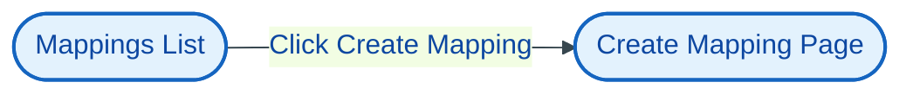
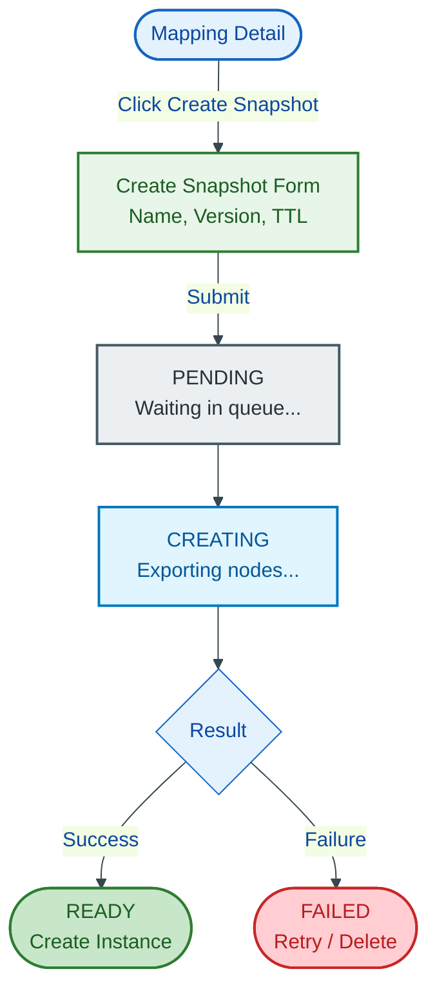
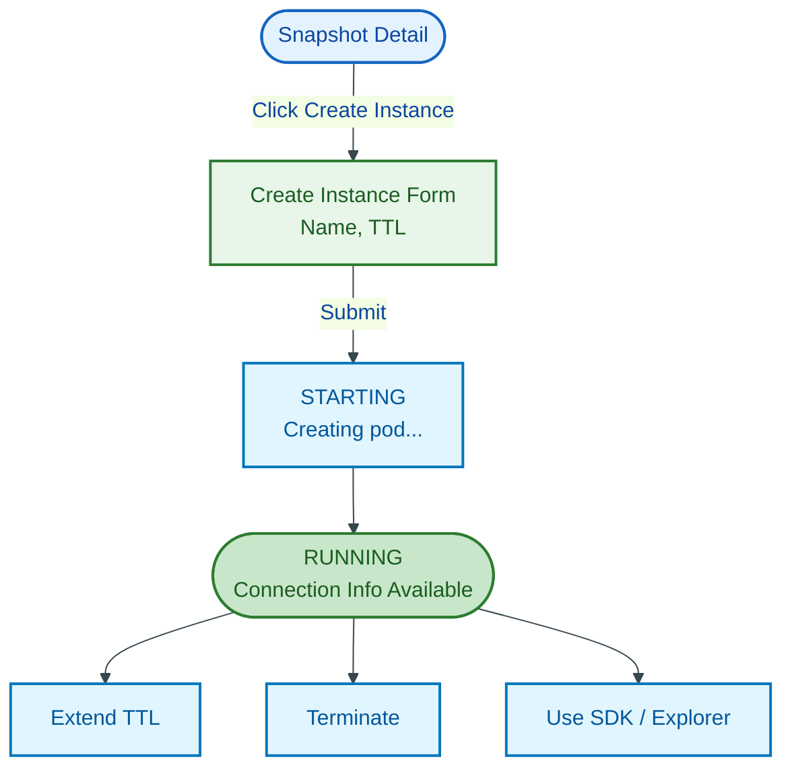

# UX Flows and User Journeys

> **DEPRECATED** - This document is no longer maintained.
>
> The Graph OLAP Platform no longer includes a web interface. All user interaction
> is now through the Jupyter SDK. This document is retained for historical reference.
>
> See [jupyter-sdk.design.md](../component-designs/jupyter-sdk.design.md) for the current user interface design.

## Overview

User journeys, page inventory, navigation patterns, and interaction sequences for the Graph OLAP Platform web interface.

## Prerequisites

- [requirements.md](../foundation/requirements.md) - UX requirements section (lines 940-1062)
- [decision.log.md](../process/decision.log.md) - ADR-006 through ADR-017
- [ux.readiness-assessment.md](./ux.readiness-assessment.md) - Product engineering readiness

---

## Page Inventory

### All Users (Analyst, Admin, Ops)

| Page | URL | Purpose |
|------|-----|---------|
| Dashboard | `/` | Landing page, recent activity, quick stats |
| Mappings List | `/mappings` | Browse, filter, search mappings |
| Mapping Create | `/mappings/new` | Create new mapping |
| Mapping Detail | `/mappings/:id` | View mapping, versions, resources |
| Mapping Edit | `/mappings/:id/edit` | Edit mapping header and definition |
| Mapping Compare | `/compare` | Compare two mapping versions |
| Snapshots List | `/snapshots` | Browse, filter, search snapshots |
| Snapshot Detail | `/snapshots/:id` | View snapshot, progress, instances |
| Instances List | `/instances` | Browse, filter, search instances |
| Instance Detail | `/instances/:id` | View instance status, connection info, terminate |
| Favorites | `/favorites` | User's bookmarked resources |

### Admin Only

Admin users have the same pages as Analysts, plus edit/delete permissions on all resources.

### Ops Only

| Page | URL | Purpose |
|------|-----|---------|
| Cluster Health | `/ops/health` | System health, component status |
| Configuration | `/ops/config` | Lifecycle, concurrency, schema, maintenance |
| Export Queue | `/ops/exports` | Export status, retry, cancel |

**Note:** Audit logs are accessed via the company's external observability stack (not in web UI).

---

## Navigation Structure

  

    

      

        Main Navigation
      

      

        

          📊
          

            
Dashboard

            
Recent activity, quick stats, getting started

          

        

        

          🗺️
          

            
Mappings

            
Graph schema definitions

          

        

        

          📸
          

            
Snapshots

            
Point-in-time data exports

          

        

        

          ⚡
          

            
Instances

            
Running graph databases

          

        

        

          ⭐
          

            
Favorites

            
Bookmarked resources

          

        

        

          👤
          

            
User Menu

            
Profile, preferences, logout

          

        

      

    

    

      

        Admin Section
        (Admin role only)
      

      

        

          ✓ All Analyst capabilities
        

        

          ✓ Edit/delete any user's resources
        

      

    

    

      

        Ops Section
        (Ops role only)
      

      

        

          💓
          

            
Cluster Health

            
Metrics, component status

          

        

        

          ⚙️
          

            
Configuration

            
Lifecycle, Concurrency, Schema, Maintenance

          

        

        

          📤
          

            
Export Queue

            
Status, retry, cancel

          

        

      

    

  

**Note:** Audit logs are accessed via the company's external observability stack, not in this UI.

---

## Page Layouts

### Dashboard

  

    
Dashboard

    
Welcome back, <strong>alice.smith</strong>

  

  

    

      
Quick Stats

      

        

          
12

          
My Mappings

        

        

          
8

          
Ready Snapshots

        

        

          
3

          
Running Instances

        

      

      
Recent Activity

      

        

          <strong>Customer Graph v3</strong> snapshot completed
          2 min ago
        

        

          Instance <strong>Analysis-001</strong> started
          15 min ago
        

        

          <strong>Transaction Network</strong> mapping created
          1 hour ago
        

      

    

    

      
Quick Actions

      

        <button style="background: #2563eb; color: white; border: none; padding: 10px 16px; border-radius: 6px; cursor: pointer; font-size: 13px;">+ Create Mapping</button>
        <button style="background: white; color: #374151; border: 1px solid #d1d5db; padding: 10px 16px; border-radius: 6px; cursor: pointer; font-size: 13px;">Browse All Mappings</button>
        <button style="background: white; color: #374151; border: 1px solid #d1d5db; padding: 10px 16px; border-radius: 6px; cursor: pointer; font-size: 13px;">View My Instances</button>
      

      
Favorites

      

        
⭐ Customer Graph v3

        
⭐ Transaction Network

        
View all favorites →

      

    

  

---

### Mappings List

  

    

      
Mappings

      
Graph schema definitions

    

    <button style="background: #2563eb; color: white; border: none; padding: 10px 20px; border-radius: 6px; cursor: pointer; font-size: 13px; font-weight: 500;">+ Create Mapping</button>
  

  

    <input type="text" placeholder="Search mappings..." style="padding: 8px 12px; border: 1px solid #d1d5db; border-radius: 6px; font-size: 13px; min-width: 200px;">
    <select style="padding: 8px 12px; border: 1px solid #d1d5db; border-radius: 6px; font-size: 13px; background: white;">
      <option>All Owners</option>
      <option>My Mappings</option>
    </select>
    <button style="padding: 8px 12px; border: 1px solid #d1d5db; border-radius: 6px; font-size: 13px; background: white; cursor: pointer;">⭐ Favorites Only</button>
    
Showing 24 of 156 mappings

  

  

    <table style="width: 100%; border-collapse: collapse;">
      <thead>
        <tr style="background: #f9fafb; border-bottom: 1px solid #e5e7eb;">
          <th style="text-align: left; padding: 12px 16px; font-weight: 500; color: #6b7280; font-size: 11px;">NAME</th>
          <th style="text-align: left; padding: 12px 16px; font-weight: 500; color: #6b7280; font-size: 11px;">OWNER</th>
          <th style="text-align: left; padding: 12px 16px; font-weight: 500; color: #6b7280; font-size: 11px;">VERSION</th>
          <th style="text-align: left; padding: 12px 16px; font-weight: 500; color: #6b7280; font-size: 11px;">SNAPSHOTS</th>
          <th style="text-align: left; padding: 12px 16px; font-weight: 500; color: #6b7280; font-size: 11px;">UPDATED</th>
          <th style="text-align: left; padding: 12px 16px; font-weight: 500; color: #6b7280; font-size: 11px;"></th>
        </tr>
      </thead>
      <tbody>
        <tr style="border-bottom: 1px solid #f3f4f6;">
          <td style="padding: 12px 16px;">⭐ <strong style="color: #2563eb; cursor: pointer;">Customer Graph</strong></td>
          <td style="padding: 12px 16px; color: #6b7280;">alice.smith</td>
          <td style="padding: 12px 16px;">v3</td>
          <td style="padding: 12px 16px; color: #6b7280;">5</td>
          <td style="padding: 12px 16px; color: #6b7280;">2 hours ago</td>
          <td style="padding: 12px 16px;">⋮</td>
        </tr>
        <tr style="border-bottom: 1px solid #f3f4f6;">
          <td style="padding: 12px 16px;">☆ <strong style="color: #2563eb; cursor: pointer;">Transaction Network</strong></td>
          <td style="padding: 12px 16px; color: #6b7280;">bob.jones</td>
          <td style="padding: 12px 16px;">v1</td>
          <td style="padding: 12px 16px; color: #6b7280;">2</td>
          <td style="padding: 12px 16px; color: #6b7280;">Yesterday</td>
          <td style="padding: 12px 16px;">⋮</td>
        </tr>
        <tr style="border-bottom: 1px solid #f3f4f6; background: #fafafa;">
          <td style="padding: 12px 16px;">☆ <strong style="color: #2563eb; cursor: pointer;">Supply Chain</strong></td>
          <td style="padding: 12px 16px; color: #6b7280;">carol.wilson</td>
          <td style="padding: 12px 16px;">v7</td>
          <td style="padding: 12px 16px; color: #6b7280;">12</td>
          <td style="padding: 12px 16px; color: #6b7280;">3 days ago</td>
          <td style="padding: 12px 16px;">⋮</td>
        </tr>
      </tbody>
    </table>
  

  

    
Page 1 of 7

    

      <button style="padding: 6px 12px; border: 1px solid #d1d5db; border-radius: 4px; background: white; font-size: 12px; color: #9ca3af;">Previous</button>
      <button style="padding: 6px 12px; border: 1px solid #d1d5db; border-radius: 4px; background: white; font-size: 12px;">Next</button>
    

  

---

### Mapping Detail

Single-page layout with section headings (no tabs).

  

    

      

        
← Back to Mappings

        

          Customer Graph
          ⭐
          v3
        

        
Customer relationship graph for fraud detection

      

      

        <button style="background: white; color: #374151; border: 1px solid #d1d5db; padding: 8px 16px; border-radius: 6px; cursor: pointer; font-size: 13px;">Edit</button>
        <button style="background: #2563eb; color: white; border: none; padding: 8px 16px; border-radius: 6px; cursor: pointer; font-size: 13px;">Create Snapshot</button>
      

    

    

      
<strong>Owner:</strong> alice.smith

      
<strong>Created:</strong> Jan 15, 2025

      
<strong>Updated:</strong> 2 hours ago

    

  

  <!-- Definition Section -->
  

    
Definition

    
Node Definitions

    

      

        
Customer

        
PK: customer_id (STRING)

        
5 properties

      

      

        
Account

        
PK: account_id (STRING)

        
3 properties

      

    

    
Edge Definitions

    

      

        
OWNS

        
Customer → Account

        
2 properties

      

      

        
TRANSFERRED_TO

        
Account → Account

        
4 properties

      

    

  

  <!-- Version History Section -->
  

    

      
Version History

      <button style="background: white; color: #374151; border: 1px solid #d1d5db; padding: 6px 12px; border-radius: 4px; cursor: pointer; font-size: 12px;">Compare Versions</button>
    

    

      

        

          
v3 Current

          
Added transaction amount property • alice.smith • 2 hours ago

        

        <button style="background: white; color: #374151; border: 1px solid #d1d5db; padding: 4px 10px; border-radius: 4px; cursor: pointer; font-size: 11px;">Create Snapshot</button>
      

      

        

          
v2

          
Added Account node type • alice.smith • 3 days ago

        

        <button style="background: white; color: #374151; border: 1px solid #d1d5db; padding: 4px 10px; border-radius: 4px; cursor: pointer; font-size: 11px;">Create Snapshot</button>
      

      

        

          
v1

          
Initial version • alice.smith • Jan 15, 2025

        

        <button style="background: white; color: #374151; border: 1px solid #d1d5db; padding: 4px 10px; border-radius: 4px; cursor: pointer; font-size: 11px;">Create Snapshot</button>
      

    

  

  <!-- Resources Section -->
  

    
Resources

    
Snapshots and instances created from this mapping

    

      

        ▼
        📸 January 2025 Snapshot
        Ready
        v3 • 2.4 GB
      

      

        

          ⚡ Analysis-001
          Running
          alice.smith
          <button style="padding: 2px 8px; border: 1px solid #d1d5db; border-radius: 4px; font-size: 10px; background: white; cursor: pointer;">Open</button>
        

        

          ⚡ Analysis-002
          Stopped
          bob.jones
        

      

      

        ▶
        📸 December 2024 Snapshot
        Ready
        v2 • 1.8 GB
      

    

  

---

## Core User Flows

### Flow 1: Create Mapping (Generate from SQL)

Based on [ADR-8](../process/adr/ux/adr-008-generate-from-sql-workflow.md).

Mermaid Source

**Create Mapping Page** (single-page form):

  

    
Create Mapping

  

  

    <!-- Header Section -->
    

      
Details

      

        <label style="display: block; font-size: 13px; font-weight: 500; color: #374151; margin-bottom: 6px;">Name *</label>
        <input type="text" placeholder="e.g., Customer Graph" style="width: 100%; padding: 10px 12px; border: 1px solid #d1d5db; border-radius: 6px; font-size: 14px; box-sizing: border-box;">
      

      

        <label style="display: block; font-size: 13px; font-weight: 500; color: #374151; margin-bottom: 6px;">Description</label>
        <textarea placeholder="Optional description" style="width: 100%; padding: 10px 12px; border: 1px solid #d1d5db; border-radius: 6px; font-size: 14px; box-sizing: border-box; min-height: 60px;"></textarea>
      

    

    <!-- Nodes Section -->
    

      

        
Nodes

        <button style="background: white; color: #2563eb; border: 1px solid #2563eb; padding: 6px 12px; border-radius: 6px; font-size: 12px; cursor: pointer;">+ Add Node</button>
      

      <!-- Node Card - Collapsed (validated) -->
      

        

          

            ▶
            Customer
            ✓ Valid
          

          <button style="color: #dc2626; background: none; border: none; font-size: 12px; cursor: pointer;">Remove</button>
        

      

      <!-- Node Card - Collapsed (validated) -->
      

        

          

            ▶
            Product
            ✓ Valid
          

          <button style="color: #dc2626; background: none; border: none; font-size: 12px; cursor: pointer;">Remove</button>
        

      

      <!-- Node Card - Expanded (editing) -->
      

        

          

            ▼
            <input type="text" value="Order" placeholder="Node label" style="padding: 6px 10px; border: 1px solid #d1d5db; border-radius: 4px; font-size: 13px; font-weight: 500;">
          

          <button style="color: #dc2626; background: none; border: none; font-size: 12px; cursor: pointer;">Remove</button>
        

        

          
SQL Query

          

            <textarea style="flex: 1; padding: 8px; border: 1px solid #d1d5db; border-radius: 4px; font-size: 12px; font-family: monospace; min-height: 40px;">SELECT order_id, total, status FROM orders</textarea>
            <button style="background: #f3f4f6; border: 1px solid #d1d5db; padding: 8px 12px; border-radius: 4px; font-size: 12px; cursor: pointer; white-space: nowrap;">Validate</button>
          

        

        
Not validated

      

    

    <!-- Edges Section -->
    

      

        
Edges

        <button style="background: white; color: #2563eb; border: 1px solid #2563eb; padding: 6px 12px; border-radius: 6px; font-size: 12px; cursor: pointer;">+ Add Edge</button>
      

      <!-- Edge Card - Collapsed (validated) -->
      

        

          

            ▶
            PURCHASED
            Customer → Product
            ✓ Valid
          

          <button style="color: #dc2626; background: none; border: none; font-size: 12px; cursor: pointer;">Remove</button>
        

      

      <!-- Edge Card - Expanded (editing) -->
      

        

          

            ▼
            <input type="text" value="PLACED" placeholder="Edge type" style="padding: 6px 10px; border: 1px solid #d1d5db; border-radius: 4px; font-size: 13px; font-weight: 500; width: 100px;">
            from
            <select style="padding: 6px 10px; border: 1px solid #d1d5db; border-radius: 4px; font-size: 12px;">
              <option>Customer</option>
              <option>Product</option>
              <option>Order</option>
            </select>
            to
            <select style="padding: 6px 10px; border: 1px solid #d1d5db; border-radius: 4px; font-size: 12px;">
              <option>Order</option>
              <option>Customer</option>
              <option>Product</option>
            </select>
          

          <button style="color: #dc2626; background: none; border: none; font-size: 12px; cursor: pointer;">Remove</button>
        

        

          
SQL Query

          

            <textarea style="flex: 1; padding: 8px; border: 1px solid #d1d5db; border-radius: 4px; font-size: 12px; font-family: monospace; min-height: 40px;">SELECT customer_id, order_id, placed_at FROM orders</textarea>
            <button style="background: #f3f4f6; border: 1px solid #d1d5db; padding: 8px 12px; border-radius: 4px; font-size: 12px; cursor: pointer; white-space: nowrap;">Validate</button>
          

        

        
Not validated

      

    

    <!-- Actions -->
    

      <button style="background: white; color: #374151; border: 1px solid #d1d5db; padding: 10px 20px; border-radius: 6px; font-size: 13px; cursor: pointer;">Cancel</button>
      <button style="background: #2563eb; color: white; border: none; padding: 10px 20px; border-radius: 6px; font-size: 13px; cursor: pointer;">Create Mapping</button>
    

  

**Key Interactions:**

1. **Add/Remove** - Click "+ Add Node" or "+ Add Edge" to add cards; click "Remove" to delete
2. **Collapse/Expand** - Click ▶/▼ to toggle card. Collapsed shows label + status only. New cards open expanded.
3. **SQL Validation** - Each node/edge has its own SQL textarea and "Validate" button
4. **Schema Browser** - Panel alongside SQL editor showing available tables/columns (ADR-012)
5. **Type Warnings** - If type not supported, show warning with CAST suggestion (don't auto-modify SQL)
6. **Column Order** - PK must be first column (nodes), from/to keys must be first two (edges) - show error if wrong
7. **Edge Dropdowns** - From/To dropdowns populate with validated node labels
8. **Validation Required** - "Create Mapping" disabled until at least one node is validated

---

### Flow 2: Create Snapshot

Mermaid Source

---

### Flow 3: Launch and Use Instance

Mermaid Source

**Button Behaviors:**

| Button | Action | Feedback |
|--------|--------|----------|
| Extend TTL | Immediately adds +24 hours to current TTL | Toast: "TTL extended. Expires in {X} hours" |
| Terminate | Inline confirmation, then terminates | Toast: "Instance terminated" |

**Extend TTL Rules:**
- Maximum TTL cap: 7 days from original creation
- Button disabled with tooltip "Maximum TTL reached" when at cap
- No confirmation required (non-destructive action)

---

### Flow 4: Compare Mapping Versions

Based on [ADR-9](../process/adr/ux/adr-009-unified-mapping-diff-page.md).

**Entry Points:**
1. Mapping Detail → Version History section → "Compare Versions" button
2. Direct URL: `/compare?a=123&av=2&b=123&bv=3`
3. Mappings List → Select two → "Compare"

  

    
Compare Mappings

    

      

        
LEFT

        <select style="width: 100%; padding: 8px 12px; border: 1px solid #d1d5db; border-radius: 6px; font-size: 13px;">
          <option>Customer Graph v2</option>
        </select>
      

      
↔

      

        
RIGHT

        <select style="width: 100%; padding: 8px 12px; border: 1px solid #d1d5db; border-radius: 6px; font-size: 13px;">
          <option>Customer Graph v3</option>
        </select>
      

    

  

  

    
Summary

    

      

        <strong style="color: #b45309;">2 Changed</strong>
      

      

        <strong style="color: #16a34a;">1 Unchanged</strong>
      

      

        <strong style="color: #dc2626;">1 Removed</strong>
      

      

        <strong style="color: #2563eb;">1 Added</strong>
      

    

  

  

    
Nodes

    

      

        
<strong>Customer</strong> (Changed)

        ▼ Expand
      

      

        <strong>Account</strong> (Unchanged)
      

      

        <strong>Merchant</strong> (Added in v3)
      

    

    
Edges

    

      

        <strong>OWNS</strong> (Changed)
      

      

        <strong>RELATED_TO</strong> (Removed in v3)
      

    

  

---

## User Preferences

Accessed via User Menu → Preferences. Available to all roles.

  

    
Preferences

  

  

    

      <label style="display: block; font-size: 13px; font-weight: 500; color: #374151; margin-bottom: 8px;">Language</label>
      <select style="width: 100%; max-width: 250px; padding: 10px 12px; border: 1px solid #d1d5db; border-radius: 6px; font-size: 14px;">
        <option>English</option>
        <option>中文 (简体)</option>
      </select>
      
Override browser language detection

    

    

      <button style="background: #2563eb; color: white; border: none; padding: 10px 20px; border-radius: 6px; font-size: 13px; cursor: pointer;">Save</button>
    

  

**Behavior:**
- Language preference stored in browser localStorage
- Applied immediately on save (page refreshes with new language)
- Persists across sessions on same browser
- Default: browser's language setting

---

## Ops Flows

### Flow 5: Cluster Health Monitoring

  

    
Cluster Health

    
System health and component status

  

  

    
Component Status

    

      

        
Database

        
Connected (5ms)

      

      

        
Pub/Sub

        
Connected

      

      

        
Kubernetes

        
Connected

      

      

        
Starburst

        
Slow (850ms)

      

    

    
Instance Summary

    

      

        
25

        
Total

      

      

        
20

        
Running

      

      

        
2

        
Starting

      

      

        
2

        
Failed

      

    

    
Cluster Limits

    

      

        Cluster Capacity
        25 / 50 instances
      

      

        

      

    

  

---

### Flow 6: Configuration Management

  

    
Configuration

  

  

    

      
Lifecycle

      
Concurrency

      
Schema Browser

      
Maintenance

    

  

  

    
Lifecycle Defaults

    

      

        
Mapping

        

          <label style="font-size: 11px; color: #6b7280; display: block; margin-bottom: 4px;">Default TTL</label>
          <select style="width: 100%; padding: 8px; border: 1px solid #d1d5db; border-radius: 4px; font-size: 13px;">
            <option>No expiry</option>
          </select>
        

        

          <label style="font-size: 11px; color: #6b7280; display: block; margin-bottom: 4px;">Inactivity Timeout</label>
          <select style="width: 100%; padding: 8px; border: 1px solid #d1d5db; border-radius: 4px; font-size: 13px;">
            <option>30 days</option>
          </select>
        

        

          <label style="font-size: 11px; color: #6b7280; display: block; margin-bottom: 4px;">Max TTL</label>
          <select style="width: 100%; padding: 8px; border: 1px solid #d1d5db; border-radius: 4px; font-size: 13px;">
            <option>365 days</option>
          </select>
        

      

      

        
Snapshot

        

          <label style="font-size: 11px; color: #6b7280; display: block; margin-bottom: 4px;">Default TTL</label>
          <select style="width: 100%; padding: 8px; border: 1px solid #d1d5db; border-radius: 4px; font-size: 13px;">
            <option>7 days</option>
          </select>
        

        

          <label style="font-size: 11px; color: #6b7280; display: block; margin-bottom: 4px;">Inactivity Timeout</label>
          <select style="width: 100%; padding: 8px; border: 1px solid #d1d5db; border-radius: 4px; font-size: 13px;">
            <option>3 days</option>
          </select>
        

        

          <label style="font-size: 11px; color: #6b7280; display: block; margin-bottom: 4px;">Max TTL</label>
          <select style="width: 100%; padding: 8px; border: 1px solid #d1d5db; border-radius: 4px; font-size: 13px;">
            <option>30 days</option>
          </select>
        

      

      

        
Instance

        

          <label style="font-size: 11px; color: #6b7280; display: block; margin-bottom: 4px;">Default TTL</label>
          <select style="width: 100%; padding: 8px; border: 1px solid #d1d5db; border-radius: 4px; font-size: 13px;">
            <option>24 hours</option>
          </select>
        

        

          <label style="font-size: 11px; color: #6b7280; display: block; margin-bottom: 4px;">Inactivity Timeout</label>
          <select style="width: 100%; padding: 8px; border: 1px solid #d1d5db; border-radius: 4px; font-size: 13px;">
            <option>4 hours</option>
          </select>
        

        

          <label style="font-size: 11px; color: #6b7280; display: block; margin-bottom: 4px;">Max TTL</label>
          <select style="width: 100%; padding: 8px; border: 1px solid #d1d5db; border-radius: 4px; font-size: 13px;">
            <option>7 days</option>
          </select>
        

      

    

    

      <button style="padding: 10px 20px; border: 1px solid #d1d5db; border-radius: 6px; background: white; font-size: 13px; cursor: pointer;">Reset to Defaults</button>
      <button style="padding: 10px 20px; border: none; border-radius: 6px; background: #7c3aed; color: white; font-size: 13px; cursor: pointer;">Save Changes</button>
    

  

---

### Flow 7: Maintenance Mode

  

    
Configuration

  

  

    

      
Lifecycle

      
Concurrency

      
Schema Browser

      
Maintenance

    

  

  

    

      

        ⚠️
        

          
Maintenance Mode

          
When enabled, new resource creation will be blocked

        

      

      

        <label style="display: flex; align-items: center; gap: 8px; cursor: pointer;">
          <input type="checkbox" style="width: 20px; height: 20px;">
          Enable Maintenance Mode
        </label>
      

      

        <label style="font-size: 11px; color: #6b7280; display: block; margin-bottom: 4px;">Message to display to users</label>
        <textarea style="width: 100%; padding: 12px; border: 1px solid #d1d5db; border-radius: 6px; font-size: 13px; resize: vertical;" rows="2" placeholder="e.g., Scheduled maintenance until 14:00 UTC"></textarea>
      

      

        <strong>What happens when enabled:</strong>
        <ul style="margin: 8px 0; padding-left: 20px;">
          <li>New mappings, snapshots, and instances cannot be created</li>
          <li>Existing resources remain accessible (read-only operations)</li>
          <li>In-flight operations continue to completion</li>
          <li>Terminate and delete operations are still allowed</li>
        </ul>
      

    

    

      <button style="padding: 10px 20px; border: none; border-radius: 6px; background: #dc2626; color: white; font-size: 13px; cursor: pointer;">Enable Maintenance Mode</button>
    

  

---

### Flow 8: Export Queue Management

  

    

      
Export Queue

      
Snapshot export jobs

    

    

      

        <strong>5</strong> Queued
      

      

        <strong>2</strong> Processing
      

      

        <strong>1</strong> Dead Letter
      

    

  

  

    <select style="padding: 8px 12px; border: 1px solid #d1d5db; border-radius: 6px; font-size: 13px; background: white;">
      <option>All Status</option>
      <option>Queued</option>
      <option>Processing</option>
      <option>Failed</option>
      <option>Dead Letter</option>
    </select>
  

  

    <table style="width: 100%; border-collapse: collapse;">
      <thead>
        <tr style="background: #f9fafb; border-bottom: 1px solid #e5e7eb;">
          <th style="text-align: left; padding: 12px 16px; font-weight: 500; color: #6b7280; font-size: 11px;">SNAPSHOT</th>
          <th style="text-align: left; padding: 12px 16px; font-weight: 500; color: #6b7280; font-size: 11px;">STATUS</th>
          <th style="text-align: left; padding: 12px 16px; font-weight: 500; color: #6b7280; font-size: 11px;">ATTEMPTS</th>
          <th style="text-align: left; padding: 12px 16px; font-weight: 500; color: #6b7280; font-size: 11px;">CREATED</th>
          <th style="text-align: left; padding: 12px 16px; font-weight: 500; color: #6b7280; font-size: 11px;">ACTIONS</th>
        </tr>
      </thead>
      <tbody>
        <tr style="border-bottom: 1px solid #f3f4f6;">
          <td style="padding: 12px 16px;"><strong style="color: #2563eb;">Customer Graph - Jan 2025</strong></td>
          <td style="padding: 12px 16px;">Processing</td>
          <td style="padding: 12px 16px; color: #6b7280;">1</td>
          <td style="padding: 12px 16px; color: #6b7280;">2 min ago</td>
          <td style="padding: 12px 16px; color: #9ca3af;">—</td>
        </tr>
        <tr style="border-bottom: 1px solid #f3f4f6; background: #fef2f2;">
          <td style="padding: 12px 16px;"><strong style="color: #2563eb;">Transaction Network</strong></td>
          <td style="padding: 12px 16px;">Failed</td>
          <td style="padding: 12px 16px; color: #6b7280;">3</td>
          <td style="padding: 12px 16px; color: #6b7280;">15 min ago</td>
          <td style="padding: 12px 16px;">
            <button style="padding: 4px 12px; border: 1px solid #d1d5db; border-radius: 4px; background: white; font-size: 11px; cursor: pointer; margin-right: 4px;">Retry</button>
          </td>
        </tr>
        <tr style="border-bottom: 1px solid #f3f4f6;">
          <td style="padding: 12px 16px;"><strong style="color: #2563eb;">Supply Chain v7</strong></td>
          <td style="padding: 12px 16px;">Queued</td>
          <td style="padding: 12px 16px; color: #6b7280;">0</td>
          <td style="padding: 12px 16px; color: #6b7280;">1 min ago</td>
          <td style="padding: 12px 16px;">
            <button style="padding: 4px 12px; border: 1px solid #fecaca; border-radius: 4px; background: #fef2f2; color: #dc2626; font-size: 11px; cursor: pointer;">Cancel</button>
          </td>
        </tr>
      </tbody>
    </table>
  

---

## Error States

### Maintenance Mode Banner

When maintenance mode is enabled, show a persistent banner on all pages:

  🔧
  

    <strong style="color: #b45309;">Maintenance Mode Active</strong>
     — Scheduled maintenance until 14:00 UTC. New resource creation is temporarily disabled.
  

---

### Concurrency Limit Exceeded

  

    ⚠️
    

      
Instance Limit Reached

      
You have reached your limit of 5 running instances. Terminate an existing instance to create a new one.

      

        <button style="padding: 8px 16px; border: 1px solid #d1d5db; border-radius: 6px; background: white; font-size: 13px; cursor: pointer;">View My Instances</button>
      

    

  

---

## Behavioral Patterns

### Concurrent Editing

**Decision:** Last-write-wins (no conflict detection).

When multiple users edit the same resource (e.g., mapping header) simultaneously:

| Scenario | Behavior |
|----------|----------|
| User A saves, then User B saves | User B's changes overwrite User A's |
| User A viewing stale data | No automatic refresh; User A sees their version until they reload |
| User A saves after User B | User A's save succeeds; User B's changes are lost |

**Rationale:**
- Acceptable for internal tool with small user base
- Reduces complexity (no locking, no conflict resolution UI)
- Mapping edits are infrequent and typically by single owner
- Users can coordinate verbally if needed

**Future consideration:** If conflicts become problematic, implement optimistic locking with "Resource was modified by another user. Reload to see changes." error on save.

---

### Session Timeout

**Decision:** Redirect to SSO on session expiry; unsaved work is lost.

Session is managed by the enterprise SSO provider (e.g., Ping, Okta). The web UI does not implement its own session management.

**Timeout Behavior:**

| Event | Behavior |
|-------|----------|
| Session expires | Next API call returns 401 Unauthorized |
| 401 received | UI redirects to SSO login page |
| After re-auth | User returns to the same URL they were on |
| Unsaved form data | Lost (no draft persistence) |

**No Pre-Timeout Warning:**
- SSO session length is controlled by enterprise policy (typically 8-12 hours)
- Web UI does not track session expiry time
- Users are not warned before timeout

**Rationale:**
- Consistent with other internal enterprise tools
- Simplifies implementation (no client-side session tracking)
- Long session times (8+ hours) make mid-work expiry rare
- Mapping creation is typically quick (<10 minutes)

---

## Related Documents

- [ux.components.spec.md](./ux.components.spec.md) - Component specifications
- [ux.copy.spec.md](./ux.copy.spec.md) - UI copy and messaging
- [decision.log.md](../process/decision.log.md) - ADR-006 through ADR-017

---

## Change History

| Date | Change |
|------|--------|
| 2025-12-12 | Initial creation with page inventory, navigation, and core flows |
