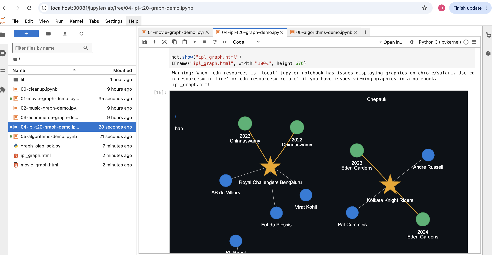

# Demo Notebooks

Six Jupyter notebooks are pre-loaded in Jupyter Labs at `http://localhost:30081/jupyter/lab`.

All notebooks are **self-contained** — they generate their own synthetic data, upload it to the local GCS emulator (fake-gcs-local), and bypass the export worker. No Starburst credentials required.

Each code cell has a **service banner** showing exactly which pod/service it talks to — useful when debugging.

---

## Notebook Overview

| # | File | Graph Domain | Algorithms |
| --- | --- | --- | --- |
| `00` | `00-cleanup.ipynb` | — | — |
| `01` | `01-movie-graph-demo.ipynb` | Movies, actors, directors, genres | Cypher traversals, PyVis |
| `02` | `02-music-graph-demo.ipynb` | Artists, albums, tracks, genres | Multi-hop queries, genre analysis |
| `03` | `03-ecommerce-graph-demo.ipynb` | Products, customers, orders, categories | Recommendation queries |
| `04` | `04-ipl-t20-graph-demo.ipynb` | Cricket players, teams, matches, seasons | Performance stats queries |
| `05` | `05-algorithms-demo.ipynb` | Co-actor network (30 actors, 25 movies) | PageRank, Betweenness, Louvain, Shortest Path, PyVis |

---

## 00 — Cleanup

`00-cleanup.ipynb`

Utility notebook for managing running instances. Run it after testing to free wrapper pod resources.

**Sections:**

1. **List active instances** — shows ID, name, owner, age, status in a DataFrame
2. **Delete ALL active instances** — one cell to terminate everything
3. **Bulk delete with filters** — delete by owner, age, name prefix, or status

```python
# Example: preview instances older than 2 hours
client.instances.bulk_delete(older_than_hours=2, dry_run=True)

# Delete for real
client.instances.bulk_delete(older_than_hours=2)
```

**Services used:** Control Plane (`graph-olap-control-plane:8080`)

---

## 01 — Movie Graph Demo

`01-movie-graph-demo.ipynb`

A movie database graph with actors, directors, genres, and ratings.

**Graph schema:**

```
(Movie) -[:DIRECTED_BY]-> (Director)
(Movie) -[:IN_GENRE]->    (Genre)
(Actor) -[:ACTED_IN]->    (Movie)
```

**Sample queries:**

```cypher
-- Most prolific directors
MATCH (d:Director)<-[:DIRECTED_BY]-(m:Movie)
RETURN d.name, count(m) AS movies ORDER BY movies DESC LIMIT 10

-- Actors who worked with a specific director
MATCH (a:Actor)-[:ACTED_IN]->(m:Movie)-[:DIRECTED_BY]->(d:Director {name: "Director A"})
RETURN DISTINCT a.name

-- Movies by genre with average rating
MATCH (m:Movie)-[:IN_GENRE]->(g:Genre)
RETURN g.name, count(m) AS movies, avg(m.rating) AS avg_rating
ORDER BY avg_rating DESC
```

**Services per step:**

| Step | Services |
| --- | --- |
| Setup + SDK init | Control Plane (:8080) |
| Generate synthetic data | Local Python — no network |
| Register mapping + snapshot | Control Plane (:8080) |
| Upload Parquet | fake-gcs-local (:4443) |
| Bypass export worker | PostgreSQL (postgres:5432) |
| Create instance + wait | Control Plane (:8080) |
| Cypher queries | FalkorDB Wrapper (pod:8000) |
| PyVis visualisation | Local — no network |
| Cleanup | Control Plane (:8080) |


---

## 02 — Music Graph Demo

`02-music-graph-demo.ipynb`

A music streaming graph with artists, albums, tracks, and genre relationships.

**Graph schema:**

```
(Artist) -[:RELEASED]->   (Album)
(Album)  -[:CONTAINS]->   (Track)
(Artist) -[:BELONGS_TO]-> (Genre)
(Artist) -[:COLLABORATED_WITH]-> (Artist)
```

**Sample queries:**

```cypher
-- Albums per artist
MATCH (a:Artist)-[:RELEASED]->(al:Album)
RETURN a.name, count(al) AS albums ORDER BY albums DESC LIMIT 10

-- Top tracks by duration
MATCH (t:Track)<-[:CONTAINS]-(al:Album)<-[:RELEASED]-(a:Artist)
RETURN a.name, al.title, t.title, t.duration_sec ORDER BY t.duration_sec DESC LIMIT 10

-- Artists in multiple genres
MATCH (a:Artist)-[:BELONGS_TO]->(g:Genre)
WITH a, collect(g.name) AS genres WHERE size(genres) > 1
RETURN a.name, genres
```

---

## 03 — E-commerce Graph Demo

`03-ecommerce-graph-demo.ipynb`

A retail graph with customers, products, orders, categories, and suppliers.

**Graph schema:**

```
(Customer) -[:PLACED]->        (Order)
(Order)    -[:CONTAINS]->      (Product)
(Product)  -[:IN_CATEGORY]->   (Category)
(Product)  -[:SUPPLIED_BY]->   (Supplier)
```

**Sample queries:**

```cypher
-- Top customers by spend
MATCH (c:Customer)-[:PLACED]->(o:Order)-[:CONTAINS]->(p:Product)
RETURN c.name, sum(p.price) AS total_spend ORDER BY total_spend DESC LIMIT 10

-- Most popular product categories
MATCH (o:Order)-[:CONTAINS]->(p:Product)-[:IN_CATEGORY]->(cat:Category)
RETURN cat.name, count(p) AS items_sold ORDER BY items_sold DESC

-- Customers who bought from multiple suppliers
MATCH (c:Customer)-[:PLACED]->(o:Order)-[:CONTAINS]->(p:Product)-[:SUPPLIED_BY]->(s:Supplier)
WITH c, count(DISTINCT s) AS supplier_count WHERE supplier_count > 2
RETURN c.name, supplier_count ORDER BY supplier_count DESC
```

---

## 04 — IPL T20 Graph Demo

`04-ipl-t20-graph-demo.ipynb`

A cricket stats graph covering IPL T20 players, teams, matches, and seasons.

**Graph schema:**

```
(Player) -[:PLAYS_FOR]->    (Team)
(Team)   -[:PLAYED_IN]->    (Match)
(Match)  -[:IN_SEASON]->    (Season)
(Player) -[:PERFORMED_IN]-> (Match)
```

**Sample queries:**

```cypher
-- Top run scorers
MATCH (p:Player)-[:PERFORMED_IN]->(m:Match)
RETURN p.name, sum(p.runs) AS total_runs ORDER BY total_runs DESC LIMIT 10

-- Teams with most wins
MATCH (t:Team)-[:PLAYED_IN]->(m:Match {winner: t.name})
RETURN t.name, count(m) AS wins ORDER BY wins DESC

-- Players who played for multiple teams
MATCH (p:Player)-[:PLAYS_FOR]->(t:Team)
WITH p, collect(DISTINCT t.name) AS teams WHERE size(teams) > 1
RETURN p.name, teams
```



---

## 05 — Algorithms Demo

`05-algorithms-demo.ipynb`

Demonstrates graph algorithm capabilities on a co-actor network (30 actors, 25 movies, ~120 co-star edges).

**What it covers:**

| Algorithm | What it finds |
| --- | --- |
| **PageRank** | Most influential actors — based on overall connectivity |
| **Betweenness Centrality** | Bridge actors — those who connect otherwise separate clusters |
| **Community Detection** (Louvain) | Actor clusters — groups who frequently work together |
| **Shortest Path** | Degrees of separation between any two actors |
| **Connected Components** | Isolated sub-networks |
| **Clustering Coefficient** | How tightly knit each actor's immediate circle is |

**How it works:**

1. Generate synthetic data (30 actors, 25 movies) — local Python
2. Upload to fake-gcs-local, bypass export worker
3. Create a FalkorDB instance, load the graph
4. Fetch all (actor, movie) pairs via Cypher
5. Build a co-actor `networkx.Graph` locally — two actors connected if they share a movie, edge weight = shared movie count
6. Run all algorithms via `conn.algo` (NetworkX, all local — no network)
7. Render interactive PyVis graph — nodes coloured by community, sized by PageRank

**PyVis output:**

Nodes = actors, coloured by Louvain community, sized by PageRank. Hover a node to see all scores. Edge thickness = number of shared movies.

**Services per step:**

| Step | Services |
| --- | --- |
| Setup | Control Plane (:8080) |
| Synthetic data | Local Python — no network |
| Register mapping + snapshot | Control Plane (:8080) |
| Upload Parquet | fake-gcs-local (:4443) |
| Bypass export worker | PostgreSQL (postgres:5432) |
| Create instance | Control Plane (:8080) · FalkorDB Wrapper (pod:8000) |
| Fetch graph data (Cypher) | FalkorDB Wrapper (pod:8000) |
| All algorithms | NetworkX — local, no network |
| PyVis render | Local — no network |
| Bulk delete demo | Control Plane (:8080) |
| Cleanup | Control Plane (:8080) |

---

## Service Banner Reference

Every code cell in each notebook starts with a 3-line banner identifying which services it uses:

```python
# ── Step 5 │ Create Instance ────────────────────────────────────────
# Services : Control Plane (graph-olap-control-plane:8080)  ·  PostgreSQL (postgres:5432)
# ──────────────────────────────────────────────────────────────────────────────────────
```

When a cell fails, the banner tells you exactly which pod to check:

```bash
# Control Plane logs
make logs SVC=graph-olap-control-plane

# FalkorDB wrapper pod (spawned per instance — find the name first)
kubectl get pods -n graph-olap-local
kubectl logs -n graph-olap-local <falkordb-wrapper-pod-name>

# PostgreSQL
kubectl exec -n graph-olap-local deploy/postgres -- psql -U graph_olap -d graph_olap -c "SELECT * FROM snapshots ORDER BY created_at DESC LIMIT 5;"

# fake-gcs-local
kubectl logs -n graph-olap-local -l app=fake-gcs-local --tail=50
```
